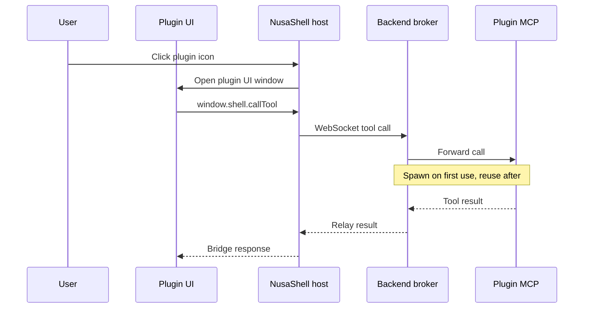

<center></center>

**A shell platform for AI tools - install plugins like you install desktop apps.**

Every plugin bundles a UI *and* an MCP server together. NusaShell manages the process
lifecycle in the background and brokers communication between the two, so your
AI tools get a real visual home instead of living only as invisible backend
integrations.

---

## Overview

MCP (Model Context Protocol) solved the problem of giving AI models structured
access to tools and data. But MCP servers are backend-only by design - there's
no notion of a visual surface. If you want a dashboard, a form, a chat panel,
or any interactive UI in front of your tool, MCP alone doesn't cover it.

NusaShell fills that gap. It's a desktop-app-like shell: a launcher with a grid
of icons (think Android's app drawer, or a desktop taskbar), where each icon
represents an installed plugin. Tap an icon and its UI opens; behind the
scenes, NusaShell spawns (or reuses) that plugin's MCP server process on
demand and brokers every tool call between the UI and the server.

**Why this exists:**

- **AI tools deserve a real UI, not just a chat log.** A lot of tool interactions
(browsing data, filling a form, watching a live dashboard) are just better as
a visual surface than as text back-and-forth.
- **Install/uninstall should feel like a desktop app.** Drop a plugin in, it
shows up as an icon. Remove it, it's gone - no config file surgery.
- **UI and backend logic shouldn't need to trust each other directly.** The
shell sits in the middle as a broker, which keeps plugin lifecycle
(spawn, suspend, kill) and communication routing in one predictable place.
- **Plugin authors shouldn't have to reinvent MCP.** If you already have an
MCP server, you mostly just add a `ui/` folder next to it - NusaShell
handles the rest.


## How it works (short version)



Plugin UI and MCP never peer-connect. The host talks to the backend over
WebSocket; the plugin iframe talks to the host via a small bridge API
(`window.shell.callTool`). See the docs map below for the full story.

## Screenshots

Captured from the Electron desktop app (`make dev`):

| Launcher | Agent workspace | Skills workspace |
| --- | --- | --- |
|  |  |  |
| Home grid with installed plugins (Files, Mail, Notes, Terminal) and live running-state badges. | Conversation rail, empty-turn state, and model-aware composer in a clean local profile. | Three-pane package browser (library, files, editor) shown in its empty state. |

## Demo videos

| Full demo | Live chat |
| --- | --- |
|  |  |
| Launch plugins, run an agent turn, and manage skills. | Chat with the agent. |

## Install

Linux and macOS:

```bash
curl -fsSL https://raw.githubusercontent.com/jahrulnr/NusaShell/master/scripts/install.sh | bash
```

Windows PowerShell:

```powershell
irm https://raw.githubusercontent.com/jahrulnr/NusaShell/master/scripts/install.ps1 | iex
```

> MCP plugins (Files, Terminal, Notes, Kanban) are **optional** — the shell
> installs without them. To install them explicitly, re-run the installer with
> `NUSASHELL_INSTALL_PLUGINS=1`, or use the repo helper:
> `make install-plugins NUSASHELL_MCP_REPO=<source>` (see CONTRIBUTING.md).
See [Install NusaShell](./docs/INSTALL.md) for checksum verification, pinned versions, update behavior, and alternatives.

Background learning (and future scheduled jobs) run only while NusaShell is
running. Enable **Keep running when window is closed** under Settings →
Startup & background so closing the window hides to the tray instead of
quitting. Optional **Launch at login** is available on packaged builds.

**Building from source or contributing?** See
[`CONTRIBUTING.md`](./CONTRIBUTING.md) for the development setup, repository
layout, and CI/release flow.

## Writing your own plugin

Cursor/repository development uses `plugins/`. The in-app agent uses the seeded
`mcp-creator` skill to author under writable `{userData}/plugins/`, then admits
the existing folder with interactive `mcp_register` before enabling it. Humans
can continue to use Add Plugin for local folders and archives.

A plugin is a folder with `manifest.json` + `mcp/`, and optionally `ui/` for a
windowed plugin. `ui/` is optional — omit it for a **headless MCP-only plugin**
(no window, not on the Home grid; managed from the Plugins view and via agent
`mcp_*` tools).

```
plugins/my-plugin/
├── manifest.json     # declares the UI entry point + how to start the MCP server
├── icon.png          # 512×512 launcher artwork (or emoji/text in manifest)
├── ui/               # optional — omit for a headless MCP-only plugin
│   └── index.html    # rendered inside a window/iframe
└── mcp/
    └── server.js      # your MCP server - any language, runs as its own process
```

Minimal manifest (windowed plugin):

```jsonc
{
  "id": "you.my-plugin",
  "name": "My Plugin",
  "version": "1.0.0",
  "icon": "file://icon.png",
  "ui": { "entry": "ui/index.html" },
  "mcp": { "transport": "stdio", "command": "node mcp/server.js" }
}
```

Headless MCP-only plugin (no `ui`):

```jsonc
{
  "id": "you.indexer",
  "name": "Indexer",
  "version": "1.0.0",
  "icon": "🧩",
  "mcp": { "transport": "stdio", "command": "node mcp/server.js", "autostart": true }
}
```

Inside your UI, call a tool without knowing anything about MCP directly:

```js
const result = await window.shell.callTool("myTool", { some: "args" });
```

NusaShell takes care of spawning your MCP process, routing the call, and
matching the response back to the right request.

The built-in plugins under `plugins/` include Notes and a read-only
Mail client. Mail demonstrates a larger plugin surface, multi-account
host-owned settings, and runtime-only credential delivery to an MCP process.

## Project status

This repo is **early scaffold with a working desktop app**: a pnpm monorepo with
implemented domain, application, infrastructure, transport, contracts, and plugin-sdk
packages; a backend composition root; and an Electron desktop shell. Architecture
docs and the PoC under `docs/` remain authoritative for product intent.

The managed agent skills library includes builtin `mcp-creator` and
`skill-creator` packages. `skill-creator` teaches progressive-disclosure skill
authoring and optional MCP requirements; it does not add `skill_exec`.

**Persistent logs:** System logs (backend, agent, plugin, MCP) are written to
`userData/logs/nusashell.log` via Pino multistream (stdout + file append).
The file survives restarts and is the primary source for post-incident debugging.

**Security & responsibility model:** NusaShell is a broker and host for AI
tools — not a security layer that certifies MCP servers or AI models. You
choose which plugins and providers to enable; plugin authors own their server
behavior; AI providers own model behavior and injection resistance. Destructive
or unexpected actions from an enabled tool or model are outside NusaShell's
product responsibility. Structural platform guards (broker isolation, lifecycle
correctness, Files/Terminal path containment, `data_is_untrusted` labels)
remain. Full stance:
[`docs/architecture/security-boundary.md`](./docs/architecture/security-boundary.md).

**Deliberately deferred** (by design, to avoid premature complexity):

- Host isolation: iframe sandboxing, install-time permission prompts, process
isolation — next phase after core plumbing, kept separate on purpose (protects
the host process; does not vet MCP/AI behavior — see security boundary above)
- Swapping the PoC hand-rolled stdio JSON-RPC for `@modelcontextprotocol/sdk`
- Idle-timeout auto-suspend for MCP processes
- Installing from a packaged `.zip` instead of a raw folder
- True multi-window support (PoC uses a single modal window)

## Documentation map

| Doc | Role |
| --- | --- |
| [`AGENTS.md`](./AGENTS.md) | Agent/human working rules, architecture locks, versioning |
| [`CONTRIBUTING.md`](./CONTRIBUTING.md) | Setup, verification, and PR norms for contributors |
| [`CODE_OF_CONDUCT.md`](./CODE_OF_CONDUCT.md) | Community standards (Contributor Covenant v2.1) |
| [`SECURITY.md`](./SECURITY.md) | Vulnerability reporting and the security responsibility split |
| [`docs/blueprint.md`](./docs/blueprint.md) | Product concept: plugin shape, launcher UX, lifecycle, MCP transports, runtime trade-offs |
| [`docs/backend-structure.md`](./docs/backend-structure.md) | Target backend: Clean Architecture monorepo, WebSocket protocol, package boundaries, MVP scope |
| [`docs/architecture/agent-runtime.md`](./docs/architecture/agent-runtime.md) | Agent turn loop, provider routing, tool-call recovery, conversation/checkpoint model |
| [`docs/architecture/agent-skills-platform-technical-spec.md`](./docs/architecture/agent-skills-platform-technical-spec.md) | Full technical spec for a general-purpose agent skills platform (draft, larger than the shipped subset) |
| [`docs/architecture/local-agent-skills.md`](./docs/architecture/local-agent-skills.md) | Current, shipped boundary of the local managed skills library and its read-only meta-tools |
| [`docs/architecture/agent-memory.md`](./docs/architecture/agent-memory.md) | Persistent agent memory (MEMORY.md + USER.md), snapshot injection, and the `memory` meta-tool |
| [`docs/architecture/mcp-agent-output.md`](./docs/architecture/mcp-agent-output.md) | Agent-readable text receipts + structuredContent for Files/Terminal; Windows shell kinds |
| [`docs/architecture/progressive-mcp-tools.md`](./docs/architecture/progressive-mcp-tools.md) | Shell-owned meta-tools used to keep MCP tool discovery bounded per agent turn |
| [`docs/architecture/job-automation.md`](./docs/architecture/job-automation.md) | Scheduled durable jobs (one-shot/recurring) that fire headless agent turns or plugin tool calls |
| [`docs/architecture/token-telemetry.md`](./docs/architecture/token-telemetry.md) | Metadata-first token-efficiency telemetry: per-request + per-turn JSONL, `traceId` correlation, local report script |
| [`docs/architecture/plugin-sandbox-readiness.md`](./docs/architecture/plugin-sandbox-readiness.md) | Files root-containment bundle guard, plugin process-death status SoT, and Tools=0 honesty mitigations |
| [`docs/architecture/workspace-mcp-binding.md`](./docs/architecture/workspace-mcp-binding.md) | How `conversation.workspace` binds to MCP (wrap → Roots → respawn/enable overrides) |
| [`docs/architecture/security-boundary.md`](./docs/architecture/security-boundary.md) | Explicit stance: NusaShell brokers MCP/AI; it does not vet plugin or model behavior |
| [`docs/RISK.md`](./docs/RISK.md) | Residual risk register: agent MCP launch overrides (`npx` swap), advisory roots |
| [`docs/INSTALL.md`](./docs/INSTALL.md) | User-space install, update channels, verification, and uninstall |
| [`resources/agent/docs/data-locations.md`](./resources/agent/docs/data-locations.md) | In-app FAQ: OS-specific data roots, file inventory, and plugin locations |
| [`resources/agent/docs/uninstall.md`](./resources/agent/docs/uninstall.md) | In-app FAQ: app uninstall versus plugin uninstall and data wipe |
| [`resources/agent/docs/contribute.md`](./resources/agent/docs/contribute.md) | In-app FAQ: clone, prerequisites, development, tests, and PR norms |
| [`resources/agent/docs/build-plugin.md`](./resources/agent/docs/build-plugin.md) | In-app FAQ: headed/windowed and headless MCP plugin authoring |
| [`docs/mcp/nusashell-mail-mcp-plugin-spec.md`](./docs/mcp/nusashell-mail-mcp-plugin-spec.md) | Mail plugin protocol assessment, security model, and target tool contract |
| [`docs/mcp/nusashell-mail-mcp-plugin-implementation.md`](./docs/mcp/nusashell-mail-mcp-plugin-implementation.md) | Implemented read-only Mail milestone, runtime wiring, and current limitations |
| [`docs/PoC/`](./docs/PoC/) | Runnable zero-dep bridge demo (behavioral reference, not the target layout) |
| [`docs/ui-design/`](./docs/ui-design/) | Instrument-workbench shell, Agent workspace, and Skills workspace visual contracts |
