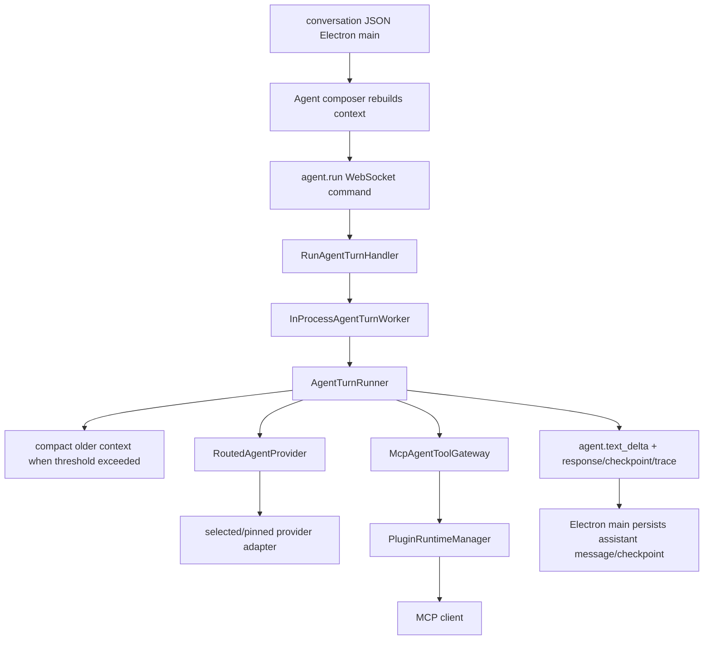

# Agent runtime

## Objective

NusaShell runs durable, bounded AI conversations whose only executable
capabilities come from MCP. The shell remains the broker: providers never
receive an MCP transport, process handle, credential, or plugin UI channel.

## Runtime flow



The turn loop is provider-agnostic. Provider-family definitions normalize
OpenRouter, OmniRoute, 9Router, OpenAI, Claude, Ollama, llama.cpp, and custom
connections; the infrastructure adapter maps their selected dialect (`chat`,
`responses`, or `messages`) to its wire format. Model catalog metadata drives
context/output limits, tool availability, image support, and reasoning effort.
Tool calls are validated against the schemas
advertised for that exact round and execute only through
`PluginRuntimeManager`. A reasoning-only/empty provider response receives one
semantic nudge on the next bounded round; a second empty result becomes an
explicit runtime response instead of an opaque failed turn.

### Local providers (Ollama, llama.cpp)

Ollama and llama.cpp are first-class presets that reuse the OpenAI-compatible
chat path — NusaShell never spawns or lifecycle-manages the server process.

- **Ollama**: default `http://127.0.0.1:11434/v1`, `api: "chat"`, API key
  optional (ignored by Ollama). Import falls back to `GET /api/tags` when
  `/v1/models` fails, then enriches each model with `POST /api/show`
  (vision/tools capabilities, `num_ctx`).
- **llama.cpp** (`llama-server`): default `http://127.0.0.1:8080/v1`,
  `api: "chat"`, API key optional. Supports both single-model (`-m`) and
  router (`--models-dir`) operator modes. Path-like model IDs are stored in
  full for requests; the UI label is the basename. Import reads `meta.n_ctx`
  / `n_ctx_train` from `/v1/models` and optionally enriches vision/context
  from `GET /props`.
- **`tool_choice` omission**: both presets omit `tool_choice` from the chat
  request body (Ollama documents it unsupported; llama.cpp is happier without
  hard requirements). The `tools` array is still sent.
- **Timeout**: both default to 180s (cold model load). Connection errors are
  wrapped with actionable copy pointing to the server start command.
- **Out of scope**: NusaShell does not spawn `ollama`/`llama-server`, pick
  GGUF paths, manage router child processes, or call native `/api/chat` /
  `/completion` endpoints.

Native JSON tool calls are preferred. A bounded parser also recovers fenced
function XML, Anthropic-style `<invoke>` blocks, and Kimi tool-use text when a
compatible gateway serializes a call as content. An identical tool request is
executed once, nudged on its second appearance, and stops the loop on its third.

## Conversations and failure recovery

- Conversations use per-room metadata plus JSONL under Electron `userData`.
  Every materialized bubble has an immutable `messageId`, a monotonic room-local
  `position`, and a monotonic `revision`; legacy rows are normalized atomically
  in their original file order. Before a provider turn starts, Electron main
  reserves the assistant slot in metadata. Completion, interruption, retry,
  resume, and Continue seal or revise that exact slot instead of mutating the
  current JSONL tail.
- System logs (backend, agent, plugin, MCP) are persisted to
  `userData/logs/nusashell-desktop.log` via Pino multistream (stdout + file).
  The file is appended to across restarts and is safe to inspect after a crash.
- The first user message creates a short deterministic title; the conversation
  list is newest-first and deletions require explicit confirmation.
- A failed provider turn does not persist a fake assistant message. The
  unanswered user message remains durable and the UI exposes **Retry turn**.
- When a provider call fails mid-turn after tool work has already accumulated,
  the runner first attempts a **soft recover** — re-calling the provider with
  the same accumulated messages up to `softRecoverAttempts` times (default 1,
  max 3, configurable via `NUSASHELL_AI_SOFT_RECOVER_ATTEMPTS`). Cancellation
  aborts immediately and is never retried. Soft recover applies after the
  shared HTTP adapter has already exhausted its transient retries (connection
  failures, `408`/`409`/`413`/`425`/`429`, `500`–`504`); permanent 4xx still
  fail the provider call immediately and then soft-recover / attach partial
  the same way when tool progress exists.
- Nested interactive confirms (`mcp_register` / `mcp_unregister`) publish
  `agent.ask_request` so the desktop can show Register/Cancel on the tool card.
  Without that event the turn appears hung on “Running…” with no logs.
- If soft recover is exhausted **or** another mid-turn failure occurs with
  progress (e.g. `listTools` failure, or **user cancel** after tools already
  ran), the runner throws with a `details.partial` snapshot containing the
  accumulated `messages`, `steps`, `toolCalls`, `traceId`, `rounds`, and
  optional `model`/`providerId`/`usage`. Cancel still uses
  `AGENT_TURN_CANCELLED` and is never soft-retried; the partial is only for
  durable resume. The **main process seals interrupted first** via
  `sealAgentInterrupted` (durable store + `resumeMessages`); the wire error
  then carries a slim partial (`messages: []`, `sealedInterrupted: true`) so
  Electron IPC cannot drop a multi-MB tool graph. The desktop seals the
  streaming UI, refreshes the store, and still shows the error footer with
  **Retry** / resume. Progress is never discarded solely because the error
  code was cancel or was not `AGENT_PROVIDER_FAILED`.
- **Soft recover is in-turn only.** `hasTurnProgress` counts only tool calls
  and `tool_calls` steps from the **current turn** — history `role: "tool"`
  messages from earlier turns do not trigger soft-recover. This prevents the
  phantom "new turn" bug where a long pure-text reply after a tool-heavy turn
  was cut mid-sentence and soft-recovered solely because the history carried
  tool messages.
- **Soft recover never rewrites painted stream.** If the failed sample already
  painted live text or reasoning (`liveText` / `liveReasoning` non-empty), the
  runner does **not** soft-recover even when in-turn tools exist. Re-sampling
  would rewrite prose/thinking already shown to the user (common after long
  tool turns + provider timeout mid-answer). Fail with `details.partial`
  instead so Desktop seals interrupted and Retry can Resume tools or Continue
  text. Soft recover only re-samples **blank** samples after tool progress
  (no deltas yet), e.g. connect/timeout before first chunk.
- **Stream timeout is idle, not wall-clock.** The OpenAI-compat provider uses
  a one-shot `timeoutMs` for the connect + headers phase, then switches to an
  **idle-reset** timer for the SSE body loop. Each successful `reader.read()`
  chunk resets the timer. Long generations that keep sending chunks survive
  even when total stream time exceeds `timeoutMs`; only a true stall (no chunks
  for `timeoutMs`) fails. The error message stays `"Provider request timed
  out"` for test stability; the `AgentProviderHttpError` phase is
  `"idle_timeout"`.
- **Parent turn IPC budget is hard wall-clock (desktop).** `agent.run` is
  invoked over Electron IPC with a 30-minute upper bound. When that fires, the
  bridge rejects with `IpcRequestTimeoutError` (`code: TIMEOUT`, message
  `IPC request timed out after Nms`) — never `String(plainObject)` / UI text
  `Turn failed: [object Object]`. A parent-turn abort seals in-flight tool and
  subagent cards, marks durable `subagentRuns` still `running` as `fail` with
  `"Subagent run did not finish before the parent turn ended."`, and clears
  `activeSubagentRunId`.
- **Streamed text is captured into partials.** The runner wraps
  `onTextDelta` / `onReasoningDelta` to accumulate `liveText` /
  `liveReasoning` even when the caller provides no delta callback. On
  mid-stream failure, `buildTurnPartial` prefers these live buffers so the
  already-painted paragraphs are preserved. The desktop interrupt seal
  prefers `partial.text` (or `streamState.streamedText` as fallback) over
  the generic interrupted template.
- **Interrupted resume has two modes: tool vs text.** When a turn is
  interrupted (cancel, provider fail, max rounds), the runner attaches
  `details.partial` whenever there is resumable progress — in-turn tools
  (`hasTurnProgress`) **or** already-streamed live text
  (`hasResumableProgress`). The desktop persists an `interrupted` assistant
  with `content` = the partial body (never the stub when body exists),
  `interruptReason` (`cancel` / `provider` / `max_rounds`), and
  `resumeMessages` **only when tools settled** (assistant toolCalls and/or
  tool results in the graph — not the inject+user preamble after a pre-tool
  provider fail). Retry then picks the mode:
  - **Tool resume**: `hasToolResumeSnapshot` (toolCalls / tool graph in
    `resumeMessages`) → `resume: true` + those messages.
  - **Text continue**: non-empty `content`, no settled tools →
    `buildContinueContext` injects `base + {role:"assistant", content:partial}
    + {role:"user", content: CONTINUE_STEER}` (steer is a fixed English
    line, not persisted as a user row). Inject-only `resumeMessages` (legacy
    seals or stale data) do **not** take the tool path.
  - **Noop**: empty body and no tools → normal `buildAgentContext`.
  `buildAgentContext` still filters `interrupted` for normal user sends so
  dead mid-cuts don't pollute history. Pure-text transport fail never
  soft-recovers (no rewrite loop); it throws with partial so the UI can
  offer Continue.
- **Unknown tool names are soft-rejected, not hard-failed.** When a provider
  (especially OpenAI-compat proxies like 9router/OmniRoute) emits tool calls
  for names outside the current NusaShell allowlist (`ReadFile`, IDE terminal,
  etc.), the `ToolExecutionPolicy` records a normal failed tool result using
  the existing `{ ok: false, error }` envelope — the rejected name, a note
  that it is not a NusaShell tool, a pointer to discovery tools
  (`tool_list`, `tool_search`, `tool_schemas` / `tool_schema`, `mcp_list`),
  and a short sample of currently advertised names. The turn continues so the
  model can recover on the next round and the FE shows a failed tool card
  instead of a global turn error. Mixed batches (unknown + known calls) keep
  provider order: unknown calls are short-circuited inside
  `executeTool` before reaching the gateway, while known calls dispatch
  normally. The gateway still throws `AGENT_TOOL_NOT_ALLOWED` on
  `callGrantedTool` when a name is missing from the per-turn route map — that
  path is caught by `executeTool`'s catch and converted to `ok: false`, so it
  acts as defense-in-depth, not the primary rejection path.
- **Retry** on an interrupted message:
  - **Tool graph**: `agent.run` with `resume: true` and saved
    `resumeMessages` (skip system-prompt injection) so the provider sees
    mid-turn tool context.
  - **Pure text / pre-tool**: `buildContinueContext` + normal inject +
    continue steer (no `resume: true`).
  On success the interrupted message is replaced with the completed
  assistant; on a new mid-turn failure the same interrupted message is
  updated. The active interrupted `resumeMessages` checkpoint is retained in
  full until that turn completes or is replaced; the store already limits a
  room to one interrupted tail. Display-only `toolCalls` / `steps` are not a
  resumable checkpoint, so legacy or damaged rows without `resumeMessages`
  must never expose a misleading Resume action.
- `buildAgentContext` skips `status: "interrupted"` messages when building
  context for a new turn — interrupted progress is reattached only via
  tool `resumeMessages` or the text-continue builder.
- Renderer-only working/error bubbles disappear after reload; durable user and
  assistant messages remain the source of truth.
- SSE text deltas update the current working bubble only. `agent.cancel`
  aborts provider HTTP, retry waits, and active MCP calls by trace ID. When
  the turn already had tool progress, cancel persists an interrupted
  assistant + `resumeMessages` so Stop → Resume continues mid-turn; cancel
  with no tool progress still leaves only the durable user message.
- User messages may persist up to four images/PDFs, each at most 4 MiB. The
  wire contract accepts bounded data URLs only; remote attachment URLs and
  arbitrary filesystem paths are rejected.

## Parallel tool rounds

When a provider round emits multiple tool calls, the runner executes them
**concurrently** by default — not sequentially. This applies to calls that
target different plugins or independent I/O; same-plugin calls naturally
serialize through the per-plugin `PluginOperationQueue` inside
`McpAgentToolGateway`.

- **Segmentation:** the batch is split into contiguous parallel-safe runs and
  standalone **barrier** segments. Barrier tools (currently `ask_question`)
  must run alone, in order — they block the turn for user input and cannot
  overlap siblings. Non-barrier neighbors form one parallel segment.
- **Bounded pool:** parallel segments run through a tiny worker pool capped at
  `maxConcurrentToolCalls` (env `NUSASHELL_AI_MAX_CONCURRENT_TOOL_CALLS`,
  default **8**, clamp 1–32). `maxConcurrentToolCalls: 1` is a full sequential
  escape hatch.
- **Order preservation:** `onToolCallStart` fires for all calls in a segment
  up front (the UI shows the full batch immediately). Results are collected
  indexed by original call order and appended to `messages`/`steps` in that
  order regardless of completion order.
- **Cancel mid-batch:** if the abort signal fires, in-flight calls drain via
  `cancelTurn` / MCP cancel. Any slot still without an execution is filled
  with a cancelled stub (`{ ok: false, error: "Tool call cancelled" }`) and
  `onToolCallEnd` is emitted so the UI seals every card. Every `tool_call_id`
  in the assistant message gets a tool result — siblings are never dropped.

## Stream reliability

Agent and ACP streaming events carry a **per-traceId `streamSeq`** — a
monotonic integer starting at 1, assigned at the application publish site
(`StreamSeqRegistry` in `container.ts` / `AcpSessionService`). The WS
transport stays a dumb broadcaster; it copies `streamSeq` into the event
payload but does not generate it. The counter is cleared when a turn ends.
For Agent turns, the request and application-owned active-turn projection also
carry the reserved assistant `messageId` and `messagePosition`. Room restore
therefore reattaches the Working draft to the same durable slot; a stale room or
retry trace cannot claim a different bubble merely because it arrives later.

### Turn lifecycle events

| Event | When | Payload |
| --- | --- | --- |
| `agent.turn_started` | Before the runner starts the first provider round | `traceId`, `streamSeq` |
| `agent.turn_end` | After the turn settles (completed / cancelled / failed / superseded) | `traceId`, `reason`, `streamSeq` |
| `agent.cancel_requested` | User clicks Stop; `cancel-agent-turn` command received | `traceId`, `streamSeq` |
| `agent.turn_superseded` | A new turn supersedes an in-flight one via `supersedeTraceId` | `traceId` (old), `byTraceId` (new) |

`agent.cancel` returns immediately with `phase: "requested"`. The UI does
**not** assume the turn is sealed at that point — it waits for
`agent.turn_end` (with a 2-second fallback timeout) before sealing streaming
tool cards and the streaming message. This prevents the "card stuck in
running" state when in-flight MCP calls take time to drain after cancel.

### Supersede

`agent.run` accepts an optional `supersedeTraceId`. When set, the handler
cancels the old trace via `AgentTurnCoordinator.cancel()` and emits
`agent.turn_superseded` so the UI can mark the old turn as superseded. The
old turn's `onTurnEnd` fires with `reason: "superseded"`.

### Desktop sequence gate

The renderer wraps streaming event handlers in a `createStreamSeqGate()`
(`stream-seq-gate.js`). The gate:

1. **Drops stale events** — `streamSeq <= lastSeen` for the same `traceId`
   is silently dropped (prevents out-of-order rendering from late events).
2. **Flags gaps** — `streamSeq > lastSeen + 1` is accepted but the gate
   calls `onStreamGap(traceId, streamSeq)` so the presenter can mark the
   turn incomplete.
3. **Accepts non-streaming events** — events without `streamSeq` pass
   through unchanged (legacy/plugin events are unaffected).

### Incomplete tool card sealing

`tool_call_start` creates a **skeleton** tool card in the presenter. The
card is only sealed (success/error state, output rendered) when the matching
`tool_call_end` arrives. If `turn_end` fires while any card is still in the
`is-running` state, `sealStreamingToolCardsIncomplete()` marks those cards
as incomplete (`is-incomplete` / `is-error` class, "Tool call did not
complete" output) so the UI never leaves a spinning card behind.

### WS-edge passthrough (no pattern scrubbing)

WS event and error mappers pass tool call args, output, error strings, and
structured error details through to the renderer **verbatim** — no
pattern-based `[REDACTED]` scrubbing is applied. NusaShell is not a
secret-filter product (see
[`security-boundary.md`](./security-boundary.md)); users may intentionally
paste credentials into tool args, and false positives on base64/hash/MD5/SHA
content are unacceptable. Size caps remain for flood control. The
`mcp_list` agent tool still returns env **keys only** (values never exposed).

## Context compaction

Before a provider round, the runner estimates input size as `chars / 4`. When
it exceeds `max input tokens - reserve tokens` (with a 1,000-token floor), the
`ContextCompactor` runs a **Codex-aligned memento replacement**:

1. **Summarize by replaying real history** — calls the provider with the full
   live `input.messages` + a trailing user message containing the `compact.md`
   instruction (`tools: []`, no mid-loop tools). The provider reply text
   becomes the summary body. This is the Codex pattern: the summarizer sees
   the full transcript with evidence, not a starved 12k-char excerpt.
2. **Quality gate** — if the provider body is empty or below `MIN_SUMMARY_CHARS`
   (80), the compactor appends an extractive excerpt from
   `formatMessagesForSummary` so the next model still gets evidence (files,
   tools, decisions). Never stores a solitary one-line ghost.
3. **Build replacement history** — `summaryText = SUMMARY_PREFIX + "\n" + body`.
   The replacement is **retained real user messages + one summary user
   message**, mirroring Codex `build_compacted_history_with_limit`. User
   messages are collected via `collectUserMessages` (skips prior
   `SUMMARY_PREFIX`-shaped messages), then packed newest-first up to
   `COMPACT_USER_MESSAGE_MAX_TOKENS` (20,000). Tools/assistant steps are **not**
   the durable keep-set; the summarizer read them only during the compact turn.
4. **Preserve leading system injects** — `splitLeadingSystemInjects` keeps the
   leading stretch of `role:"system"` messages at the head of the replacement
   (re-applied by `injectPrompts` at turn boundaries).
5. **Drop oldest if still over** — if the packed replacement still exceeds the
   soft threshold, the compactor drops the oldest retained user message
   iteratively (Codex compact-retry spirit), then runs in-list tool shrink on
   any remaining tool remnants.
6. **Checkpoint** — `{ summary, retainedUserMessages, compactedMessageCount,
   estimatedInputTokens, via }`. `compactedMessageCount` is the absolute store
   offset (mapped at seal time on the desktop side). `retainedUserMessages` is
   the packed user texts (chronological) so the desktop can reconstruct the
   memento on the next turn.

The summary is a `role:"user"` message with the `SUMMARY_PREFIX` marker, not a
`role:"system"` blurb. This is the Codex invariant: the model treats the
summary as durable context from "another language model," not a system
instruction. `isSummaryMessage` detects both the Codex `SUMMARY_PREFIX` and
the legacy `Conversation summary:` marker for one-release migration.

The provider context for every turn carries reconstructed assistant
`toolCalls` plus one `role: "tool"` result per call. `buildAgentContext` (in
the renderer) expands each persisted assistant message that carries `toolCalls`
into the assistant tool-call message followed by one `role: "tool"` result
per call, preferring the persisted canonical `modelOutput` for result content.
That exact string is also what the UI tool card renders, so transcript display,
rehydration, and the live provider turn cannot drift. Calls missing `id` or
`name` are skipped; order is preserved. Tool results from `mcp_*` tools are
wrapped in a compact `<untrusted_tool_result …>` XML boundary so the model can
identify both start and end of untrusted plugin data. Mid-turn and in-list tool
shrink unwrap the payload, clamp the raw body, then wrap once — never end-slice a finished envelope
(that drops the close tag). Without this
reconstruction the model would see an assistant
claim with no tool-use record and no results, and could not verify what was
actually done.

### Tool-result dual representation

Tool results follow a **canonical typed model** (`AgentToolResult`) that
preserves MCP structure on ingestion and projects a model-facing text string.
The dual representation fixes early MCP flatten (which discarded
`structuredContent` and threw on `isError`) and universal `JSON.stringify`
(which made every result a flat string regardless of shape).

**Canonical model** (`agent-tool-result.ts`):
- `status`: `success` | `error` | `cancelled` | `timeout`
- `content`: typed parts (`{type:"text"}` or `{type:"json"}`)
- `structuredContent`: preserved from MCP when available
- `metadata`: `truncated`, `dataIsUntrusted`, `exitCode`, `nextCursor`, etc.
- `error`: `{code, message, retryable}` for non-success statuses
- `modelOutput`: exact projection string cached after first projection

**Ingestion** (`ingestMcpToolResult`): MCP `isError` no longer throws —
execution errors become `{kind:"error"}` so the gateway builds a
model-recoverable `AgentToolResult` with `ok:false`. Transport/protocol
failures (RPC disconnect, timeout) still throw at the client adapter.

**Projection** (`projectModelToolResult`): one serialization boundary only.
- When MCP returns an agent-readable `content[0].text` **and** `structuredContent`,
  projection prefers the text body (verbatim stream sections) while keeping
  structured data on the canonical result for UI/host consumers. See
  `docs/architecture/mcp-agent-output.md`.
- Structured-only path: compact terminal-style `key=value` lines; homogeneous
  records become TSV tables.
- Text/command path: preserve plugin text receipts verbatim.
- Error path: real error message body.
- Every `mcp_*` result is enclosed by the compact XML boundary
  `<untrusted_tool_result source="…" status="…">` …
  `</untrusted_tool_result>`.

**Truncation** (`truncateToolResultText`): head+tail with explicit
`[omitted: N chars]` marker — never silent head-only slice on the new path.

**Durable store**: `AgentConversationToolCall` carries optional `modelOutput`,
`status`, `truncated`, and `structuredContent`. Rehydrate prefers `modelOutput`
over `output` so the next turn sees the exact mid-turn projection.

**Provider edge**: `AgentMessage.toolIsError` (optional boolean) is set when
`toolResult.status !== "success"`. The Anthropic Messages adapter maps it to
`is_error: true` on `tool_result` blocks. OpenAI adapters ignore it.

### Dual-space checkpoint (desktop)

The durable checkpoint is persisted by Electron main and reconstructed by
`buildAgentContext` on the next turn:

```text
[re-injected system prompts via injectPrompts]
… retained prior user messages (from retainedUserMessages[]) …
user: <SUMMARY_PREFIX>
<summary body>
… residual store messages (after compactedMessageCount) …
```

When `retainedUserMessages` is present, `buildAgentContext` uses the memento
shape (retained users + summary user + residual). When it is absent (legacy
checkpoints from before the Codex alignment), the old shape is used
(`system: Conversation summary:\n…` + residual slice) for one-release
migration. `mergeCompactionCheckpoint` carries `retainedUserMessages` forward
on recompaction.

New checkpoints also persist `compactedThroughPosition`. The renderer anchors
the visible compaction marker to that immutable boundary; the legacy
`compactedMessageCount` remains available for context reconstruction and old
rooms, but array indexes no longer decide where the marker appears.

`formatMessagesForSummary` **excludes injected system prompts** (`system.md` /
`mcp-tools`). The runtime snapshot is a hidden synthetic tool transcript,
persisted separately from visible conversation history and excluded from summary input. Only prior summary markers, user, assistant, and ordinary tool
messages enter the handoff excerpt — otherwise a ~12k summary budget is
exhausted by setup text and the checkpoint LLM invents a "fresh session / no
user request" handoff (observed after max-round "lanjut" on fat tool turns).

### Runtime hydration (full running catalog)

When a room has no hydration checkpoint and after compaction,
`RuntimeHydrationBuilder` creates one synthetic tool transcript:
`runtime_context`, `memory` (`action: "list"`), `skill_list`,
`mcp_list`, `tool_list`, and, when a conversation has open work, `todo_list`.
`todo_list` is a read-only snapshot of the conversation TODO SoT; it is not a
model-issued tool call. The MCP slots carry the runtime-authoritative
running-plugin catalog (tool name, description, and `inputSchema`) without
placing volatile state in the system prefix. The latest complete graph is
persisted in `<conversationId>.runtime.json`, not the visible message JSONL,
and replayed after the first user message on every later provider turn. A new
workspace or compaction boundary atomically replaces that sidecar. Hydration is
never rendered as a chat row and never enters compaction summaries.

Running tools are also auto-advertised in provider `tools[]` via `listTools`
auto-seeding. This array is capped at 96 MCP tool entries beyond shell
meta-tools and is refreshed per provider round. The synthetic `tool_list` is
the larger read-only catalog used to recover context after a fresh-room start
or compaction. `command.resume` does not rebuild hydration until a compaction
boundary. Snapshot retrieval is fail-soft and bound to the gateway instance.

### Mid-turn memento (in-turn roll-over)

After each **completed** tool batch (function call + tool results already on
the live messages array), if the estimated context is still over the soft
budget, the runner runs the **same memento `compact()`** used at turn start —
not an endless in-place clamp of tool payloads:

1. Tool pairs settle first (no compact between call and result).
2. Memento replaces history with packed user messages + summary; **drops**
   prior `assistant` toolCalls / `role:tool` messages.
3. Next `provider.complete` is a clean sample: old `tool_call_id` values are
   intentionally not re-sent (Codex “new room” for the API prefix). New tools
   use new ids. Workspace/disk state is unchanged.
4. Soft tool-content `shrink()` remains only as residual cleanup (or when
   barely over before memento would fire) and for envelope-safe clamping when
   tools are still present.

This prevents long-task amnesia where mid-turn shrink repeatedly erased early
tool evidence while keeping an invalid-looking “same chat” tool graph.

Hitting `maxToolRounds` throws `AGENT_MAX_TOOL_ROUNDS` with a mid-turn
`partial` (resumeMessages) so the UI seals an interrupted assistant and
Resume continues from the exact message log — it must not seal a completed
"reached maximum rounds" answer that forces a brand-new turn.

Opening the conversation later sends the retained user messages + summary +
only messages after `compactedMessageCount`. Recompaction replaces the
previous summary and advances the absolute checkpoint without duplicating
already-compacted messages.

## Provider retry

All supported provider dialects use one bounded retry policy in the shared
HTTP adapter. Connection failures and HTTP `408`, `409`, `413`, `425`, `429`,
and `500`–`504` are transient. Other 4xx responses fail immediately.

Backoff is exponential with bounded jitter. `Retry-After` delta-seconds or
HTTP-date overrides the calculated delay but is still capped. One router-owned
attempt budget spans retries and failover candidates. Successful providers are
pinned for later tool rounds, but a transient failure can still move the turn
to the next enabled provider. Auth and validation failures never fail over.

## Configuration

Environment is currently the process-level runtime boundary:

| Variable | Default | Purpose |
| --- | ---: | --- |
| `NUSASHELL_AI_STUB` | `false` | Enable the deterministic test provider. It is never listed in production UI. |
| `NUSASHELL_AI_PROVIDER` | empty | Initial provider slot ID |
| `NUSASHELL_AI_MODEL` | empty | Initial model ID |
| `NUSASHELL_AI_BASE_URL` | empty | Initial provider base URL |
| `NUSASHELL_AI_API_KEY` | empty | Initial API key; never returned or logged |
| `NUSASHELL_AI_MAX_TOOL_ROUNDS` | `50` (cap `10000`) | Maximum provider/tool rounds per turn (`0` = unlimited) |
| `NUSASHELL_AI_SOFT_RECOVER_ATTEMPTS` | `1` | Mid-turn soft recover retries after a provider call fails with tool progress already accumulated (0–3) |
| `NUSASHELL_AI_MAX_CONCURRENT_TOOL_CALLS` | `8` | Maximum concurrent tool executions within a parallel segment (1–32; 1 = sequential) |
| `NUSASHELL_AI_MAX_AUTO_CONTINUES` | `10` (cap `10000`) | Outer multi-turn auto-continue budget — chained turns after a successful seal while open todos remain (`0` = unlimited) |
| `NUSASHELL_AI_STRATEGY` | `failover` | `failover`, `round-robin`, or selected-provider `switch` |
| `NUSASHELL_AI_TOTAL_ATTEMPT_BUDGET` | `4` | Shared retry/failover attempt ceiling per provider round |
| `NUSASHELL_AI_STREAM` | `true` | Request SSE where the provider dialect supports it |
| `NUSASHELL_AI_VISION` | `auto` | `auto`, `on`, or `off` image-pixel gate |
| `NUSASHELL_AI_TIMEOUT_MS` | `60000` | Provider request deadline |
| `NUSASHELL_AI_RETRY_ATTEMPTS` | `4` | Total HTTP attempt budget |
| `NUSASHELL_AI_RETRY_BASE_DELAY_MS` | `250` | First exponential backoff step |
| `NUSASHELL_AI_RETRY_MAX_DELAY_MS` | `5000` | Backoff and Retry-After ceiling |
| `NUSASHELL_AI_RETRY_JITTER` | `0.2` | Backoff jitter fraction |
| `NUSASHELL_AI_CONTEXT_COMPACTION` | `true` | Enable context compaction |
| `NUSASHELL_AI_CONTEXT_MAX_INPUT_TOKENS` | `200000` | Hard cost ceiling on the compaction input estimate (see below) |
| `NUSASHELL_AI_CONTEXT_RESERVE_TOKENS` | `16000` | Output/tool reserve |
| `NUSASHELL_AI_CONTEXT_RECENT_TURNS` | `4` | Raw user turns retained |
| `NUSASHELL_AI_CONTEXT_SUMMARY_MAX_CHARS` | `12000` | Checkpoint character bound |

### Compaction ceiling: `min(maxInput, modelWindow)`

The effective context window is `min(settings.maxInputTokens, model contextWindow ?? family heuristic ?? 200k)`.
`maxInputTokens` is a **hard cost ceiling** — the 200k unknown-model default
only fills a **missing** model window; it does **not** override an explicit
`maxInputTokens`. With the fresh-install defaults (200k maxInput + 16k reserve
+ 200k model), `soft ≈ 180k`. With an explicit thrift budget (12k maxInput +
3k reserve), `window = 12k` and `soft = 9k` — intentional, not a formula bug.

Saved `ai-settings.json` values are preserved on upgrade; the fresh-install
defaults only apply when the key is absent or invalid. Raising
**Settings → Max input tokens** (e.g. 128000 or 200000) is the user-facing
escape hatch when long tasks compact too aggressively.

Provider connections, imported models, selected model, and effort are persisted
through the dedicated Electron provider registry. API keys use Electron
`safeStorage`; the renderer receives only masked availability.

## System prompts

`RunAgentTurnHandler` loads prompt files from `resources/agent/prompts/` via
`FilesystemPromptLoader` and injects them before conversation messages reach the
runner. The injection point is the application layer (backend), not the renderer.

| File | Role | Template vars |
| --- | --- | --- |
| `system.md` | Stable agent identity and cross-cutting operating rules | No |
| `mcp-tools.md` | Stable progressive tool/disclosure protocol | No |
| `subagent-delegation.md` | Parent-agent delegation boundary + brief guidance, embedded in `runtime_context.subagents.delegationGuide` snapshot (not injected as a system prompt) | Yes (interpolated at snapshot assembly) |
| `subagent.md` | ACP subagent execution contract, prepended to each delegated task | No (ACP only) |
| `compact.md` | Compaction instruction for the checkpoint LLM call | No |
| `continue.md` | Outer auto-continue steering: pursue open CURRENT TASKS | No |

`system.md` and `mcp-tools.md` are the whole cache-stable system prefix.
Runtime facts (date, environment, OS, workspace, memory, skills, MCP catalog,
TODO state, and subagent routing) arrive as a hidden read-only hydration
transcript after the durable user history, not as a dynamic developer prompt.
`subagent-delegation.md` is loaded separately (only when the `subagent` tool is
available) and placed into the `runtime_context.subagents.delegationGuide` JSON
field, carrying `available`/`default` routing. It is never injected as a system
message. `subagent.md` is loaded separately
and prepended only to ACP subagent tasks, never injected into the parent-agent
turn. Compaction summary messages from prior turns
are preserved; non-summary system messages from the conversation are dropped to
avoid duplicate or stale instructions.

If the prompt loader fails (missing files, I/O error), the handler logs a
warning and sends the raw conversation messages without injected prompts.

The compaction prompt (`compact.md`) replaces the previously hardcoded
compaction instruction string in `AgentTurnRunner`. If the file is absent, the
runner falls back to the built-in default.

## Documentation tools

The agent can search and read an internal Markdown corpus located in
`resources/agent/docs/` through shell-owned meta-tools:

- `docs_search` — lexical keyword search returning scored chunks.
- `docs_list` — lightweight catalog of all indexed documents.
- `docs_read` — full document or single chunk read, with `max_chars` and
  `offset` pagination.

`MarkdownDocsIndex` in the infrastructure layer walks `docsRoot`, builds an
index JSON in `docsIndexStorageRoot`, and caches it in memory. The index is built
lazily on first query if it is not already ready. The gateway returns structured
envelopes (`{ ok, data, meta }`) with `meta.data_is_untrusted: true` so the model
treats the returned text as reference material, not privileged instructions.

The `ui/` subdirectory is generated from `resources/agent/docs/ui-source/ui-map.json`
at build time by `pnpm scan:ui-docs` (also run as a `prebuild` hook). It
contains one Markdown file per NusaShell view and describes the purpose of each
view, how to open it, and every control or interaction within it. Agents should
search this corpus first when the user asks how to navigate NusaShell or use a
specific UI element.

## Stability boundary

Tools, prompts, resources, resource templates, completion, and logging are the
stable MCP surface used by this phase. Elicitation and other evolving MCP
capabilities remain documented in `progressive-mcp-tools.md` but are not
silently exposed to the model until their protocol and consent semantics are
stable.

## Async tool handles

Agent tool calls are blocking by default. The `async_run` / `async_wait` /
`async_peek` / `async_kill` meta-tools let the agent opt into non-blocking
background execution for long-running work (forever-watchers like `docker logs
-f`, long builds, servers).

### Handle registry

`AsyncToolRuntime` (application layer, in-memory SoT) owns all background
handles. Each handle has:

- `handleId`, `conversationId`, `traceId` (spawn turn), `kind` (`mcp` |
  `subagent`), `pluginId`, `toolName`, `status` (`running` | `ok` | `fail` |
  `killed`), `startedAt`, `endedAt`, ring buffer of text (capped at 256KB), and
  the final JSON result.

APIs: `spawn`, `peek`, `wait(timeoutMs)`, `kill`, `list(conversationId)`,
`killAllForConversation`, `appendTail`, `dispose`.

`wait` is harness-local (Promise + timer + status watch) — the model never
calls a `sleep` tool. `async_wait` is a barrier tool (runs alone, like
`ask_question`).

### Cancel scopes

- **Turn cancel ≠ job kill.** Stopping the turn aborts in-turn `async_wait`
  calls and sync MCP calls, but never the handle-owned signal of a background
  MCP call. Background handles keep running unless the agent or user kills
  them.
- **User kill** via the job card Stop button calls `agent.tool_job_kill`, which
  soft-cancels the handle.
- **Conversation delete** kills all running handles for that conversation
  (client-side cleanup before deleting the conversation).
- **App quit** disposes the runtime, killing all remaining handles.

### Events

- `agent.tool_job_started` — handleId, name, args summary, conversationId.
- `agent.tool_job_update` — handleId, status, tail (clamped), bytes, streamSeq.
- `agent.tool_job_ended` — handleId, ok, error?, output?, reason
  (`completed` | `killed` | `failed`).

### MCP without streaming

Until MCP supports progress notifications, `async_peek` returns status + empty
tail for most plugins. The handle is still useful: the agent can detach, keep
reasoning, and `async_wait` for the final result. Terminal streaming peek
(Phase C) adds real partial stdout for forever commands via MCP progress
notifications — see below.

### Streaming peek (Phase C)

The Terminal plugin sends MCP `notifications/progress` with partial stdout
chunks as they arrive. The shell's MCP client wires `onProgress` through the
tool-call tracker → `callGrantedTool` → `AsyncToolRuntime.appendTail`, which
publishes `agent.tool_job_update` events. The desktop job card shows the live
tail in real time.

Plugins that do not send progress notifications (Files, Notes, etc.) are
final-result-only: `async_peek` returns status + empty tail until the call
completes. The handle is still useful for detach + `async_wait`.

### Hard process kill (Phase C)

`async_kill` does two things:

1. **Aborts the in-flight MCP call** — the per-handle `AbortController` fires,
   which cancels the pending tool call in the tool-call tracker. The MCP SDK
   also passes the `AbortSignal` to the server's request handler, so the
   plugin can kill its own subprocess (Terminal does this with `SIGKILL`).
2. **Settles the handle as `killed`** — the runtime marks the handle and
   publishes `agent.tool_job_ended` with `reason: "killed"`.

For `subagent(async: true)`, the same handle abort explicitly calls
`SubagentPort.cancel(runId, conversationId)` before the handle settles. A
handle cannot merely show `killed` while its ACP session keeps working.

Plugin stop uses `ProcessHandle.killGroup()` (Unix: `process.kill(-pid)`,
Windows: `taskkill /T /F /PID`) to terminate the MCP server process and all
its children — so a Terminal plugin that spawned a long-running command gets
fully cleaned up when the user stops the plugin.

Turn cancel does **not** kill background handles — only the per-handle
`AbortController` or explicit `async_kill` / `agent.tool_job_kill` does.

### Completion steering (Phase D)

When a background job ends and the conversation is idle (no active turn), the
desktop auto-starts a follow-up turn with a synthetic system message
containing the job completion summary. This lets the agent react to
background results without the user having to manually prompt it.

The `CompletionSteerer` (desktop renderer) subscribes to `tool_job_ended`
events, debounces 500ms to coalesce multiple completions, checks
`isConversationRunning(conversationId)`, and calls `submit()` with a formatted
summary. If the conversation has an active turn, an unsent composer draft, or
IME composition, the completion is retained (not dropped) and retried when the
room becomes idle. Overflow beyond ten coalesced jobs is delivered in later
wakes, so every completion remains available to the agent.
Turn tracking is per-conversation (`pendingTurnConversations` set), so a
background turn in one room does not block steering or submitting in another.

Every steering decision (fired or skipped) is recorded as a `steering`
telemetry record via the `telemetry.record_steering` command — metadata-only
(`triggeredAt`, `jobCount`, `outcome`, and a `reason` when skipped), never the
steer prompt or job output. It feeds the Usage dashboard.

### User messages while a task is running

The composer implements non-interrupting steering. While a room owns an active
turn, the user may keep typing and submit one non-empty draft. The renderer
submits that draft to the active trace without cancelling provider reasoning or
tool execution. The application keeps one pending steer per room. The runner
reads that inbox at two explicit safe boundaries: after a provider sample
finishes reasoning but before any newly proposed tool calls start, or after a
tool batch that was already live settles. Proposed calls from the superseded
direction are discarded before execution. If the steer arrived during a
terminal text sample, that completed sample becomes an assistant segment and
the same trace continues for another round. This is true same-turn steering,
not a follow-up turn queue.

The composer moves the submitted draft into a compact steer card immediately.
It can be cancelled while still queued; after consumption it changes to an
applied status until the turn settles. Durable replay is segmented as
`assistant → user steer → assistant`, preserving the exact provider-visible
ordering across room reloads and future turns. Duplicate sends are disabled
while one steer is pending.

The explicit Stop action remains distinct: it cancels the active turn and
invalidates any pending steer for that room, while retaining the steer as an
editable draft. A pending steer also suppresses automatic TODO continuation so
the latest human instruction takes priority at the next safe boundary.

At the prompt layer, humans may also type "stop" or "berhenti" as a normal
message rather than pressing Stop. Because the agent sees user messages,
completion steering, and auto-continue all as plain `user` messages,
`system.md` states the priority contract explicitly:

- The **latest user message is an active instruction** — answer questions, weigh
  suggestions, then continue per open TODOs; never drop the task merely because
  a message arrived.
- **Completion-steering notices are information, not instructions** — record the
  result, update TODOs only when the task changes, and keep working.
- **Typed "stop"/"berhenti" is a real halt** — stop the turn, mark unfinished
  TODOs as cancelled (or remove when asked), do not continue.
- **Scope/priority changes update TODOs** instead of silently dropping state.

The steering summary header was changed to
`[Background job completed — information only, not a user instruction]` and
`continue.md` now also honors a typed halt and defers to a newer user message.

This is intentionally prompt-level defense-in-depth, not flow control: the
same contract will shape any future voice input path (a "stop" spoken by the
user maps to the same typed-stop semantics without re-architecting the turn
loop or todo store). The TODO interruption/`interrupted` status remains a
candidate future enhancement (see telemetry steering reasons), not part of
this change.

## Multi-turn auto-continue (Codex-inspired outer loop)

After a **successful sealed turn**, if the conversation task checklist still
has open items (`pending` or `in_progress`), the desktop starts the next
turn automatically — without a user message. This lets the agent work
through a multi-step plan in one shot, guided by its own todo list, instead
of requiring the user to say "continue" after each step.

### Decision

`decideAutoContinue` (application layer, pure function) is called from
`RunAgentTurnHandler.withAutoContinue()` on every successful turn. It
attaches an `autoContinue` decision to the `AgentTurnResult`:

| Field | Meaning |
| --- | --- |
| `shouldContinue` | Whether the desktop should start the next chained turn |
| `openTodoCount` | Items with status `pending` or `in_progress` |
| `continuesUsed` | How many auto-continues have already run (0 = user turn) |
| `maxAutoContinues` | Chain budget (env `NUSASHELL_AI_MAX_AUTO_CONTINUES`, default 10, cap 10,000; `0` = unlimited) |
| `reason` | `continue` / `no-open-todos` / `max-reached` / `turn-not-ok` / `no-conversation` |

The decision is **omitted** on failed, cancelled, or superseded paths — the
desktop never chains those. It is also omitted when no `conversationId` is
bound or no todo port is configured.

### Continue steering prompt

When `autoContinueIndex > 0`, the handler loads `continue.md` via
`PromptLoaderPort.loadContinuePrompt()` and injects it as an internal `user`
message after the durable conversation history. The desktop does **not**
append a user row for this message — it exists only in the provider payload
for that chained request. The prompt instructs the agent to pursue open
CURRENT TASKS, verify before claiming done, keep the todo list accurate, and
stop when everything is complete. Auto-continue also refreshes the hydration
checkpoint, so its following `todo_list` result reflects the current TODO SoT
rather than a prior turn's snapshot.

### Desktop chain

The `AgentConversationController` orchestrates the chain:

1. After `submit()` seals a successful turn, it checks
   `result.autoContinue.shouldContinue`.
2. If true, `runAutoContinueChain(conversationId, continuesUsed + 1)` runs
   successive turns in a `while` loop, each with an incrementing
   `autoContinueIndex`.
3. Each chained turn rebuilds context from the durable conversation (no new
   user message), creates a fresh streaming message, and calls `runTurn`
   with `autoContinueIndex` set.
4. The chain **aborts** when:
   - `shouldContinue` is false (no open todos, budget exhausted, etc.)
   - The user clicks **Stop** (`autoContinueAborted` flag)
   - The user sends a new message (`isConversationRunning` guard at loop top)
   - The user switches conversations (`conversation.id` guard)
   - A chained turn fails or is cancelled (error handler breaks the loop)
5. The status bar shows `Continuing tasks… (n/max)` (finite) or
   `Continuing tasks… (n)` (unlimited, `maxAutoContinues === 0`) during each
   chained turn, and `Idle` when the chain ends.

### Ceiling semantics (0 = unlimited)

Both the inner tool-round ceiling (`maxToolRounds`) and the outer
auto-continue budget (`maxAutoContinues`) support **`0` = unlimited** as an
opt-in escape hatch for long unattended agentic runs:

- `maxToolRounds: 0` — the `AgentTurnRunner` loop never throws
  `AGENT_MAX_TOOL_ROUNDS`; termination is via final answer, cancel/stop,
  unrecoverable provider error, or the existing repeat tool-call guard.
- `maxAutoContinues: 0` — `decideAutoContinue` never returns `max-reached`
  from budget; the chain stops only when open todos = 0, the turn fails, or
  the user clicks Stop.

Stop always ends the active turn **and** the auto-continue chain.
Unlimited is intentional opt-in, not a silent default.

### Async subagent sugar (Phase D)

The `subagent` tool accepts `async: true` to run the subagent in the
background via `AsyncToolRuntime`. The agent gets a `handleId` immediately
and can use `async_wait` / `async_peek` / `async_kill` to manage it. This is
useful for long-running subagent tasks (e.g. "refactor this module while I
continue working").

### Wait interrupt on explicit turn cancellation (Phase D)

`async_wait` races the wait against the turn's abort signal. If the user
presses Stop, or a caller explicitly supersedes/cancels the current turn, the
wait returns immediately with `interrupted: true` and the current status —
instead of blocking until the timeout. The background handle keeps running.
Submitting a composer steer does not abort `async_wait`; the steer remains
cancellable until that barrier tool returns, then enters the same turn before
the next provider sample.
