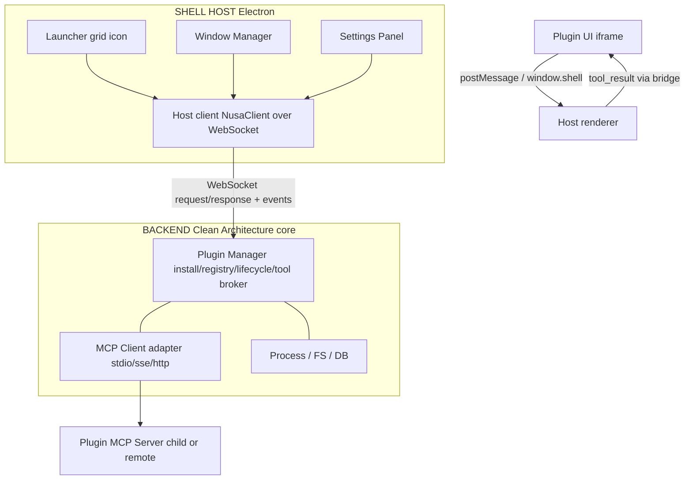
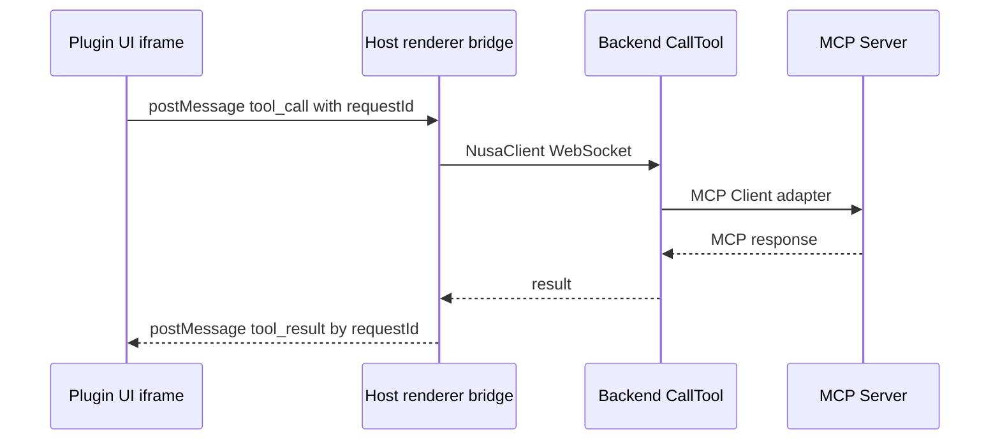
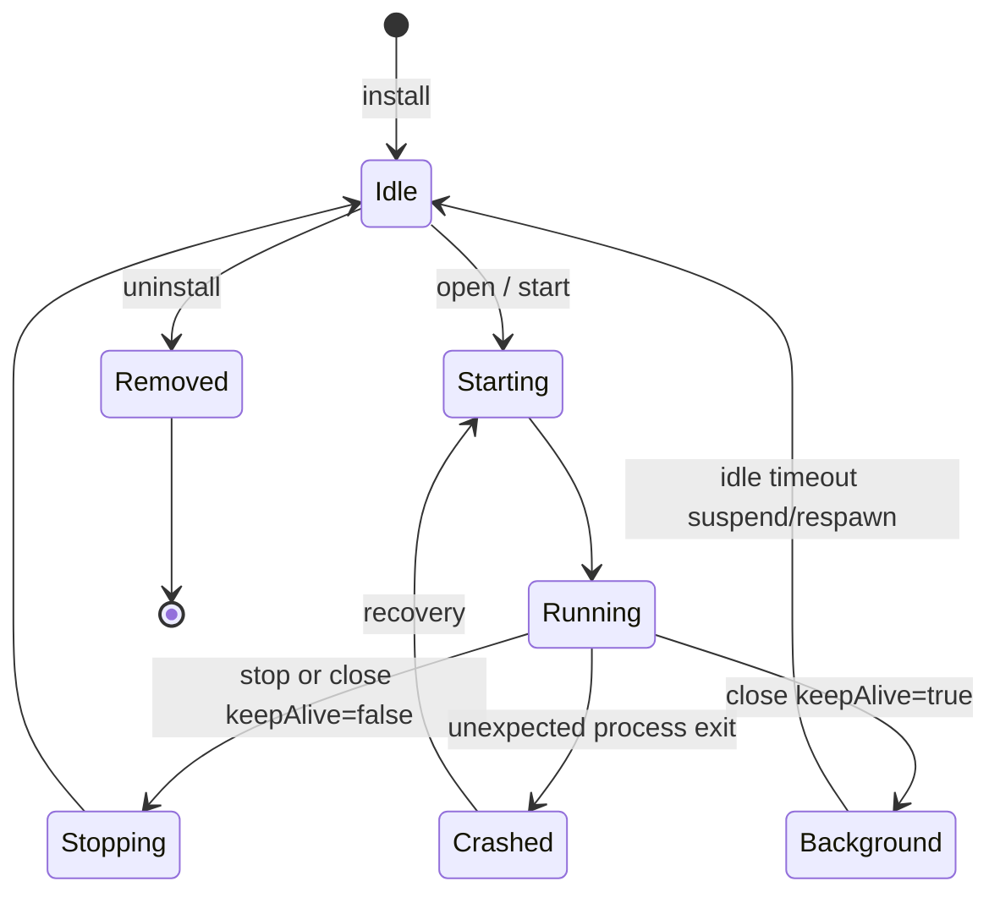

# NusaShell Blueprint

> Product concept: a desktop-app-like **shell**. Each plugin is a **UI + MCP server**
> bundle. Install a plugin → its icon appears in the launcher (Android app-drawer
> style) → tap → open the UI; the MCP process is spawned in the background as needed.
>
> **Role of this doc:** product / plugin architecture and UX. Backend monorepo,
> Clean Architecture, and the WebSocket protocol live in
> [`backend-structure.md`](./backend-structure.md). The runnable PoC lives in
> [`PoC/`](./PoC/).
>
> **Scope note:** **host isolation** (iframe sandbox attributes, install-time
> permission prompts, process isolation, signing) is intentionally **not**
> detailed in this phase. Focus first on architectural correctness and DX.
> Host isolation may be added later as a separate layer, not mixed in from day
> one. That deferred layer does **not** include vetting MCP server behavior,
> moderating AI model output, or prompt-injection defenses — those stay
> permanently out of scope; see
> [`architecture/security-boundary.md`](./architecture/security-boundary.md).

---

## 1. High-Level Architecture



The two plugin sides (**UI** and **MCP**) **never peer-connect**. Everything goes
through the Shell as broker. That keeps lifecycle management in one place (one
kill path, not many connections to chase).

### 1.1 Two transport layers (do not conflate)

| Layer | Mechanism | Role |
| --- | --- | --- |
| Plugin UI ↔ Host renderer | `postMessage` + `window.shell.callTool` helper | Plugin-author DX; the iframe never speaks raw MCP |
| Host ↔ Backend | WebSocket (`ws`), protocol in `backend-structure.md` | Commands/queries + state events; **not** an internal event bus |

The PoC under `docs/PoC/` collapses both layers into one Node + HTTP process for
easy demos. That is a **behavioral reference**, not the target layout.

---

## 2. Language & Runtime Choices for the Shell Backend

Compared across four axes: **language/ecosystem**, **cross-platform
compatibility**, **development ease**, and **user install ease**.

### Option A - Go

| Aspect | Notes |
| --- | --- |
| Compatibility | Compiles to a single binary per OS (Windows/Linux/macOS); no separate runtime |
| Dev ease | Goroutines are a good fit for many MCP processes. Embedded UI/webview ecosystem is thinner |
| User install | **Very easy** - one binary, double-click / run, no dependency |
| MCP client lib | Community SDK (`mcp-go`); stdio/sse well supported |
| UI hosting | Needs a webview bind (`webview/webview_go` → WebKit/WebView2) or a fuller alternative like **Wails** |
| Verdict | Strong when priorities are fast startup, light resources, simple distribution. **Wails** (Go backend + web frontend, native webview) is a solid candidate |

### Option B - Rust

| Aspect | Notes |
| --- | --- |
| Compatibility | Same as Go: single binary, solid cross-compile |
| Dev ease | Steeper learning curve, but **Tauri** is mature for this case - Rust backend + web frontend + native webview, plus its own plugin system (useful as a design reference, not only as a host) |
| User install | Native installers per OS (msi/dmg/AppImage); small size (does not ship Chromium like Electron) |
| MCP client lib | Official Anthropic Rust SDK (`rmcp`); process spawn is straightforward via `tokio::process` |
| Verdict | If the team already knows Rust or is willing to learn, **Tauri** is the most “ready-made” fit for a shell + plugin pattern - Tauri’s own plugin ideas map closely to what we want |

### Option C - Electron (Node.js)

| Aspect | Notes |
| --- | --- |
| Compatibility | Most proven cross-platform story, but Chromium+Node bundle is large (100MB+) |
| Dev ease | **Fastest for prototyping** - one language (JS/TS) for shell, UI, and even plugin MCP servers. npm covers child_process, IPC, etc. out of the box |
| User install | Large installer, but familiar UX (VS Code, Slack, Discord are all Electron) |
| MCP client lib | Official TypeScript SDK is the most complete and up to date |
| Verdict | Best when **development speed** matters and the team (including future plugin authors) is JS/TS-native. Trade-off is size and memory |

### Option D - .NET (MAUI/Avalonia + WebView)

| Aspect | Notes |
| --- | --- |
| Compatibility | Most native on Windows; Linux/macOS take more effort (Avalonia helps cross-platform) |
| Dev ease | C# is comfortable for structured plugin systems (interfaces, built-in DI) |
| User install | Needs a .NET runtime (or a self-contained publish that grows the binary) |
| Verdict | Candidate mainly for Windows-enterprise audiences. Weaker fit for a general/cross-platform target |

### Recommendation

Given priorities of **compat + dev ease + install ease**, and a build-first /
fast-exploration style:

- **Fastest velocity now (prototyping / near-term product):** **Electron + TypeScript**.
  One language across layers; VS Code’s extension model is a close reference
  (extension contributes UI + backend logic).
- **Mid-term “production-grade” path:** **Tauri (Rust backend)**. Smaller size,
  native webview per OS, and Tauri’s plugin API as a direct design reference
  (or even a host to build on, instead of reinventing the shell).

Plugin MCP servers **do not** need to share the shell’s language - they talk over
a separate process (stdio/sse/http). Authors can use Python/Go/Node/anything.
The shell only needs to spawn/connect and speak standard MCP.

---

## 3. Plugin Architecture

### 3.1 Package layout

A plugin is one folder with `manifest.json` + `mcp/`, and optionally `ui/` +
an icon asset. Two shapes ship:

**UI plugin** (gets a Home tile and a window):

```
my-plugin/
├── manifest.json          # metadata + entry points
├── icon.png               # 512x512, for the launcher (or emoji/text in manifest)
├── ui/
│   ├── index.html
│   ├── bundle.js          # UI logic; talks via the bridge
│   └── style.css
├── mcp/
│   ├── server.js          # or any-language binary/script
│   └── package.json       # (if the MCP server is Node-based)
└── README.md
```

**Headless MCP plugin** (no window, not on Home; managed from Plugins view
and via agent `mcp_*` tools):

```
my-indexer/
├── manifest.json          # metadata + MCP transport; no `ui`
├── mcp/
│   └── server.js
└── README.md
```

### 3.2 Manifest spec (early draft)

```jsonc
{
  "id": "nusashell.notes",
  "name": "Notes",
  "version": "1.0.0",
  "icon": "icon.png",

  // `ui` is optional. Omit it for a headless MCP-only plugin.
  "ui": {
    "entry": "ui/index.html",
    "window": {
      "mode": "panel",       // "panel" | "fullscreen" | "widget"
      "defaultSize": { "width": 800, "height": 600 },
      "resizable": true
    }
  },

  "mcp": {
    "transport": "stdio",     // "stdio" | "sse" | "http"
    "command": "node mcp/server.js",
    "env": {},                // optional env vars at spawn
    "autostart": false,       // spawn at install, or lazy on open?
    "keepAliveOnClose": false // keep MCP alive after the UI closes?
  },

  "dependencies": {
    "shell": ">=1.0.0"        // minimum shell version compatibility
  }
}
```

Design notes:

- `mcp.command` is a general command string - the shell just `spawn()`s a process
  and does not care which language is behind it (Node/Python/Go binary are all
  valid if executable on the target environment).
- `autostart` vs lazy spawn: default is **lazy** (spawn when the user first opens
  the UI) so idle cost stays low - similar to an Android Service bound on demand.
  For headless plugins, `autostart: true` is the normal way to start the MCP
  server at boot since there is no UI to open.
- `keepAliveOnClose`: for plugins with background work (file watchers, scheduled
  sync). The MCP process stays up after the window closes and shows a “running”
  badge on the launcher icon.
- **`ui` optional:** omit `ui` for a headless MCP-only plugin. Headless plugins
  never open a `BrowserWindow`, do not appear on the Home launcher grid, and are
  managed from the **Plugins** view (Start / Stop / Autostart / uninstall) and
  via agent `mcp_*` tools. `icon` stays required (emoji/text is valid). The
  in-app agent authors only under writable `userData/plugins/` and must use
  confirmation-gated `mcp_register`; repository `plugins/` remains the Cursor/
  monorepo development target and bundled `resources/plugins/` is read-only. At
  install time, when `ui.entry` is declared the shell `access()`es the resolved
  file under the plugin folder and fails the install early if it is missing or
  escapes the plugin dir; local file icons get the same check.

### 3.3 Communication Bridge

Iframe layer (author DX):



Pair requests and responses with a `requestId` (UUID) so the UI can have multiple
pending calls without races. The shell exposes a small helper into each iframe
(via `postMessage` + preload), roughly:

```js
// Injected into each plugin UI context
window.shell = {
  callTool: (toolName, args) => {
    const requestId = crypto.randomUUID();
    return new Promise((resolve) => {
      pendingCalls.set(requestId, resolve);
      parent.postMessage({ type: "tool_call", tool: toolName, args, requestId }, "*");
    });
  }
};
```

Plugin authors call `await window.shell.callTool("createNote", { text })` and never
need raw MCP details - the shell owns that. Command bus / WebSocket frames:
[`backend-structure.md`](./backend-structure.md).

### 3.4 Plugin Registry (local state)

**Installed metadata** (id, version, path, settings) is persisted in local app data.
**Live runtime state** (starting/running/etc.) is **not** owned by the registry -
it belongs to the backend runtime manager (see `backend-structure.md` §17).

PoC / early spikes may use flat JSON + folder scan. The target monorepo uses
SQLite for installed metadata; a filesystem registry is still fine in the earliest
phase before SQLite is wired.

```jsonc
// example "installed" projection (not the SoT for live runtime)
{
  "installed": [
    {
      "id": "nusashell.notes",
      "version": "1.0.0",
      "installedAt": "2026-07-27T10:00:00Z",
      "path": "/plugins/nusashell.notes"
    }
  ]
}
```

### 3.5 Lifecycle State Machine

Normative states follow the backend (`backend-structure.md`):

```text
idle | starting | running | background | stopping | crashed | disabled
```

Conceptual flow (UI / user-facing):



The frontend may cache a state projection for launcher badges; **authoritative**
live state stays in `PluginRuntimeManager` (backend).

### 3.6 Install / Uninstall Flow (simplified; no security checks yet)

**Install:**

1. User drops a `.zip` / `.tar.gz` package (or later a marketplace URL)
2. Shell extracts into `plugins/<id>/`
3. Parse `manifest.json`, validate required fields
4. When `ui.entry` is declared, `access()` the resolved file under the plugin
   folder (fail install early if missing or outside the dir); local file icons
   get the same check. Headless plugins (no `ui`) skip the entry check.
5. If the MCP side needs dependency install (e.g. `npm install` in the MCP folder), run it once at install
6. Register in the installed-metadata store
7. UI plugins appear on the Home launcher grid; headless plugins appear only
   in the Plugins view

**Uninstall:**

1. Kill the MCP process if still running
2. Delete `plugins/<id>/`
3. Remove the registry entry
4. Icon disappears from the launcher

---

## 4. UI Design - Instrument Workbench Launcher

### 4.1 Layout

```
┌─ NusaShell · Connected ─────────────── ⚙  pin  window controls ─┐
├───────────────────┬──────────────────────────────────────────────┤
│ Home              │  NusaShell                                   │
│ Agent             │  Your AI tool shell — plugins with real UIs.│
│ Skills            │                                              │
│ Learning          │  [ Search installed apps…              ] All│
│ Plugins           │                                              │
│ AI Providers      │   [ Files ] [ Mail ] [ Notes ] [ Terminal ] │
│ Autostart         │                                              │
│ Logs / Jobs       │                                              │
│                   │                                              │
│ + Add Plugin      │                                              │
│ ────────────────  │                                              │
│ Docs / Collapse   │                                              │
└───────────────────┴──────────────────────────────────────────────┘
```

The visual contract is detailed in
[`ui-design/shell-workbench.md`](./ui-design/shell-workbench.md). The shell uses
graphite instrument surfaces, compact corner radii, and a phosphor accent kept
strictly for connection, selection, running state, focus, and primary actions.
Nested rails and plugin launch plates provide a physical-console signature;
ordinary cards stay quiet so dense Agent, Skills, Jobs, and Logs workspaces
remain comfortable for long sessions.

- Icon grid; click → open the plugin window/panel. **Home shows UI plugins only**;
  headless MCP-only plugins (no `ui` in their manifest) never get a Home tile and
  are managed from the Plugins view instead.
- Small badge on the icon when the plugin is `running` / `background`
- Right-click → context menu: **Open, Start, Force Stop, Restart, Details, Uninstall**;
  **Open** is disabled for headless plugins (no window to open). Editable fields
  get shell-owned **Cut / Copy / Paste** backed by the Electron clipboard bridge.
- Home owns the installed-app search because it filters only plugin cards by name, ID, or manifest description; the title bar does not imply a global search. Plugin artwork may be an emoji, HTTP(S) URL, or a plugin-relative local asset such as `file://icon.png`; local assets resolve to absolute `file://` URLs before the renderer displays them. Image and emoji artwork share one icon plate, and transparent PNG margins are normalized at render time so plugins keep comparable visual weight without rewriting their source assets.
- Shell-owned chrome uses the NusaShell tile-and-wave emblem as its primary small-size brand mark. The detailed horizontal logo remains reference artwork; compact surfaces pair the simplified SVG emblem with a live text wordmark so both stay sharp at desktop title-bar scale. Windows and Linux launcher/plugin windows also receive a transparent PNG rendition at runtime, including development, so native window previews and taskbar/dock entries do not fall back to Electron's default icon; packaged builds copy that PNG into the application resources.
- `➕ Install New` → URL input or native operating-system pickers for a local plugin folder/archive (later: marketplace browser). The selected local path is read-only.
- Launcher navigation is **Home**, **Agent**, **Skills**, **Learning**, **Plugins**, **Autostart**, **AI Providers**, **Jobs**, **Pipelines**, and **Logs**. The sidebar supports persisted icon-only and icon-with-text modes; its footer opens the project docs on GitHub. The Skills view is a three-pane managed workspace for installing `.skill`/`.zip` packages, browsing package files, editing bounded UTF-8 text, viewing binary metadata, and deleting the managed copy. The Plugins view combines installed metadata with each plugin's live MCP state. Settings opens from the top-bar gear, and the adjacent pin toggles always-on-top mode for the current launcher session.
- Overview views open directly into their working surface; the selected sidebar item provides page identity instead of a repeated large page title. Pages with actions use a compact 48px toolbar that retains controls such as Install package, Refresh, and New job/pipeline. Detail and form views keep their explicit back navigation.
- Agent is a shell-owned durable conversation workbench. Its fixed left rail lists locally persisted conversations with search, new-conversation, and confirmed deletion actions; the wider message runway and raised composer dock fill the remaining shell viewport. MCP catalog/scope/context controls are intentionally absent: the provider starts from bounded shell-owned meta-tools and can discover or start servers, request one concrete tool schema, and access prompts/resources through `mcp_context`; all execution remains brokered by the shell. Every transcript bubble has immutable identity, room-local position, and revision metadata; the assistant position is reserved before streaming so stale snapshots, retries, and late seals can update only their original bubble. Older transcript context is compacted into a durable position-anchored checkpoint while recent user turns remain raw. Failed turns keep the user message and expose an explicit retry action. The composer streams text into one pending response, exposes a real Stop action backed by runtime cancellation, and accepts up to four bounded image, PDF, or text attachments. Its textarea starts at one row, grows with content, and caps at ten rows before scrolling internally. The compact footer separates attachment/model/workspace context from context usage and turn actions; long labels truncate, and the action cluster wraps below only at very narrow widths. User turns render as compact cards with persisted attachment previews and copyable timestamped footers; completed agent answers use a full-width editorial surface with model/trace metadata and a collapsible timeline of persisted tool-call outcomes. The UI does not imply live tool progress until the backend emits it. Only the completed response is durable. The conversation list and composer remain fixed; only the message thread scrolls, and attach/stop/send use compact icon controls. A shell-owned **Agent Canvas** pane sits beside the conversation: completed assistant messages auto-render `svg` and `mermaid` fences inline (mermaid is lazy-loaded with `securityLevel: 'strict'`) and a Sidebar action promotes any canvas fence (`html`/`htm`/`svg`/`mermaid`) into the pane. HTML fences stay as source until a Preview action opens them in a sandboxed iframe (`sandbox="allow-scripts"`, no `allow-same-origin`, CSP with an empty external allowlist in v1). Artifacts persist per conversation and restore on reopen; a Settings toggle disables the canvas. The canvas is shell chrome, not a plugin window; it does not expand the deferred host-isolation or MCP/AI behavioral-security scope.
- Provider configuration lives in the dedicated **AI Providers** view. Each configured provider card exposes details and confirmed deletion; deleting a connection removes its encrypted credential and imported models, clears a stale active model, and removes its live runtime adapter. The detail surface supports editing the connection, importing its bounded `/models` catalog, and inspecting model context, modality, tool, and reasoning metadata. A default model is optional. The Agent composer searches the combined catalog across enabled providers and selects effort from the levels advertised by each model. Model modality metadata is informational: unless image input is explicitly disabled in runtime settings, the provider sends image parts optimistically and retries once without them after a 4xx response. Agent runtime routing, streaming, and image delivery settings are persisted and hot-reloaded from Settings. Credentials are stored only by the Electron main process through OS-backed `safeStorage`; the renderer receives only masked availability.
- MCP capability adoption follows [`mcp-capability-policy.md`](./architecture/mcp-capability-policy.md): tools, prompts, resources, and completion are the stable implementation track; deferred capabilities remain documented for operator and agent knowledge but are not advertised as supported.
- Each installed plugin has a shell-owned **Start MCP when NusaShell opens** preference in its detail sidebar. The preference persists with installed metadata; startup attempts opted-in MCPs independently and logs failures without blocking the launcher. This is **plugin MCP autostart**, separate from OS login autostart in Settings.
- **Startup & background** (Settings): the shell can stay resident in the system tray when the launcher window closes, so background review, skill curator, and future scheduled jobs keep running. Explicit Quit from the tray menu still shuts the backend down. Optional **Launch at login** writes an OS login entry (Linux XDG `~/.config/autostart/nusashell-desktop.desktop` today; macOS/Windows login-item APIs are wired for packaged builds). **Start in tray** launches with `--hidden` so login start does not open a window. A single-instance lock focuses the existing window on a second launch.
- Logs is a shell-owned live tail for renderer, Electron, IPC, backend, and MCP output. Source chips expose retained entry counts and explain what produces an empty source. Its card fills the remaining shell viewport and scrolls internally instead of stopping at a fixed height. It retains at most 1,000 entries and shows raw retained entries with source chips; no pattern-based secret scrubbing is applied (NusaShell is not a secret-filter product).
- Jobs is a shell-owned surface for scheduled and event-triggered automation. Each job fires either a headless agent turn (agent mode: required prompt + optional model picker, costs tokens) or a direct plugin tool call (tool mode: plugin/tool dropdowns + schema-driven arg form, no AI model) on a once/interval/cron schedule or when a matching automation event fires. Jobs run only while NusaShell is open; a one-shot missed while the app was closed is marked errored, not silently fired. The view lists all jobs with trigger, mode, repeat progress, and next run time; each row offers Run, Stop (cancel in-flight), Pause/Resume, Edit, Output, and Remove. A modal form creates/edits jobs with a trigger picker (schedule vs event), live schedule validation, event pattern input with hints from connected plugin manifests, and mode-dependent fields. Event jobs support `{{event.type}}`, `{{event.pluginId}}`, and `{{payload.*}}` template resolution in prompts and tool args. `job.started`/`job.completed`/`job.failed`/`job.cancelled` events trigger a desktop toast and list refresh; the output modal renders markdown as sanitized HTML and can expand each entry to show the full body. See `docs/architecture/job-automation.md` for the full design.

### 4.2 Window Management

Each plugin opens as:

- **Panel** (default): tab/pane inside the main shell window - good for light plugins (notes, calculator)
- **Fullscreen**: takes the whole shell viewport - good for complex plugins (design tools, dashboards)
- **Widget**: small, dockable in a sidebar - good for always-visible plugins (mini chat, clock)

Mode comes from the plugin manifest (`ui.window.mode`); users can override per plugin.
Declared default dimensions are capped to the active display work area. Plugin
surfaces remain responsible for responsive layouts down to their declared
minimum size rather than relying on a desktop-sized viewport.

The shell launcher itself supports a **tray-resident** mode: closing the
launcher hides it when "Keep running when window is closed" is enabled. Plugin
windows are closed when the app fully quits; they are independent of tray hide.

### 4.3 Multi-window / Multi-tab

To support several plugins open at once (like a real desktop):

- Top tab bar; each tab = one plugin window instance
- Each tab has its own iframe + bridge toward that plugin’s MCP client
- Switching tabs does **not** kill the MCP process (Plugin Manager owns the process, independent of UI visibility)

---

## 5. MCP Transport Comparison for Plugins

| Transport | Best when | Notes |
| --- | --- | --- |
| `stdio` | The plugin MCP server runs as a local child process | Simplest; shell fully owns lifecycle (spawn/kill) |
| `sse` / `http` | The MCP server already exists as a remote service (plugin is mostly a UI wrapper) | No process to spawn; connect to a URL. Uninstall only removes the UI package |

**Recommendation:** support **both** in the manifest schema (`mcp.transport`) from
the start. Many real-world plugins will wrap an existing hosted MCP server rather
than shipping a new server from scratch.

---

## 6. Decision Summary & Next Steps

| Decision | Initial choice |
| --- | --- |
| Shell runtime | Electron + TypeScript (velocity) → migrate toward Tauri once stable |
| Backend shape | Clean Architecture monorepo; details in [`backend-structure.md`](./backend-structure.md) |
| Host ↔ backend | WebSocket (`ws`) as client transport; not an internal bus |
| Plugin UI ↔ host | iframe + `postMessage` / `window.shell.callTool` |
| Plugin bundling | One folder = manifest + `mcp/` (optional `ui/` for windowed plugins) |
| MCP connect | child_process (stdio) or existing remote (sse/http) - schema supports both |
| Installed metadata | filesystem/JSON early → SQLite in the monorepo MVP |
| Live runtime state | `PluginRuntimeManager` in-memory (not duplicated in DB/renderer/gateway) |
| Host isolation | **deferred** - iframe sandbox, install permissions, process isolation as a later additive layer (not MCP/AI behavioral hardening; see [`architecture/security-boundary.md`](./architecture/security-boundary.md)) |

**Status & next steps:**

1. ~~Minimal shell PoC~~ - already in [`docs/PoC/`](./PoC/) (launcher + Notes + stdio bridge)
2. Scaffold the target monorepo (`apps/` + `packages/`) per [`backend-structure.md`](./backend-structure.md) §2 / §18
3. Finalize the manifest schema (JSON Schema / Zod) + `validate-manifest` script
4. Swap PoC hand-rolled JSON-RPC → official `@modelcontextprotocol/sdk`
5. Exercise `keepAliveOnClose` + idle suspend on one real background case
6. Only then enter the **host isolation** phase: iframe sandboxing, permission dialogs, process isolation (not MCP/AI behavioral vetting — see [`architecture/security-boundary.md`](./architecture/security-boundary.md))
