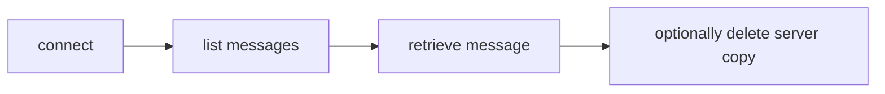
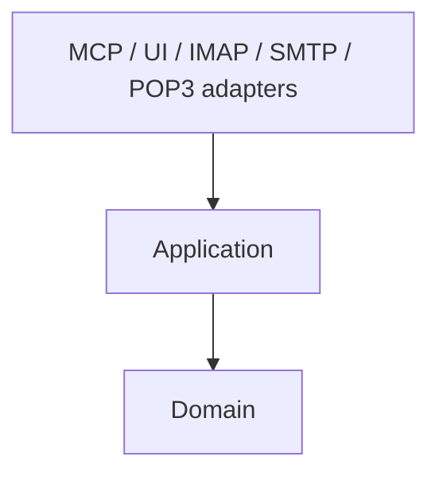
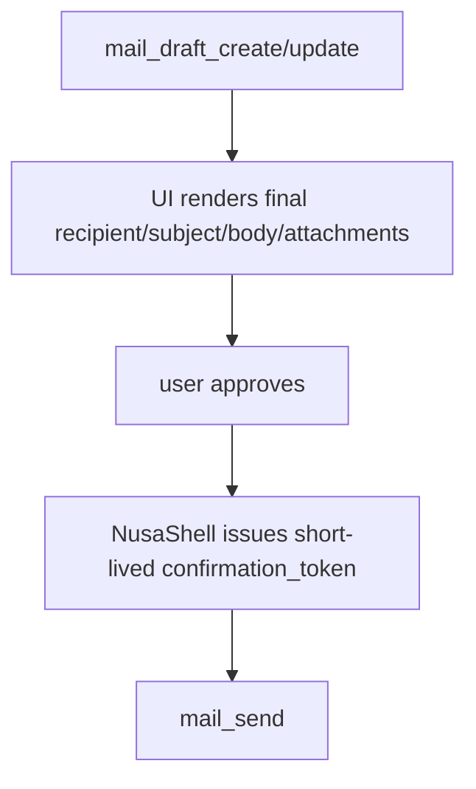
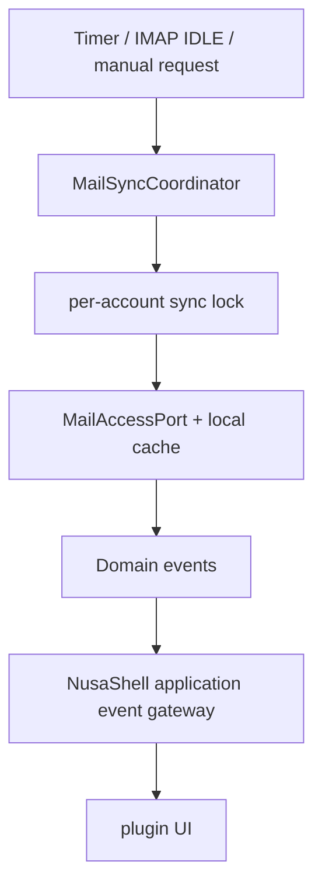
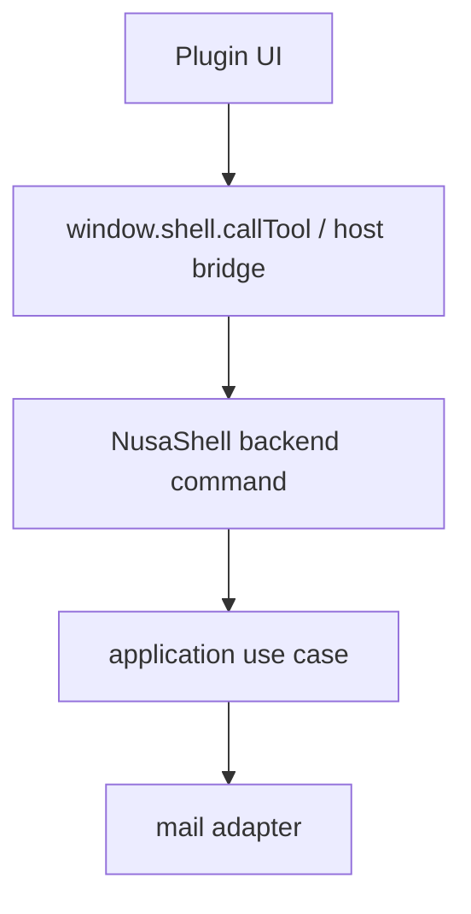
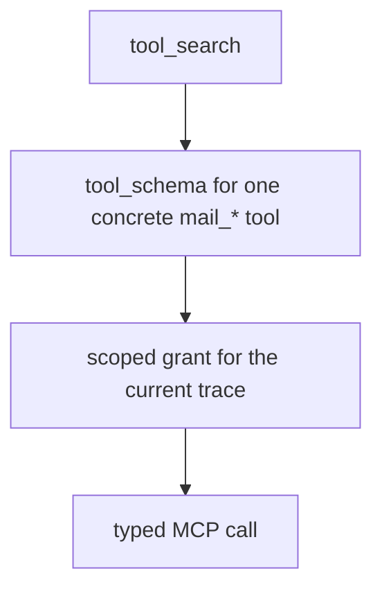
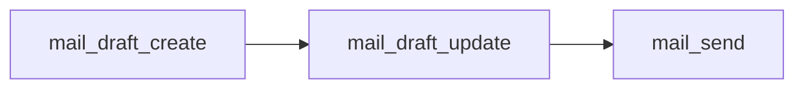

# NusaShell Mail MCP Plugin — Technical Specification

Status: Proposed architecture and MVP tool contract  
Target: NusaShell local MCP plugin  
Primary protocols: IMAP for mailbox access, SMTP Submission for sending  
Compatibility protocol: POP3 for receive-only legacy accounts

---

## 1. Executive Decision

The plugin should not model email as “POP3 or SMTP.” These protocols solve different halves of the problem:

- **IMAP** is the primary mailbox protocol: folders, message listing, flags, search, move/copy, delete, and synchronization.
- **SMTP Submission** is the outbound protocol: sending a composed MIME message.
- **POP3** is an optional legacy receive adapter. It is not sufficient for a modern mailbox UI or full CRUD because it has no portable folder model, draft storage, sent mailbox synchronization, read/unread flags, server-side search, or message move operation.

Recommended MVP:

```text
Inbound mailbox: IMAP over implicit TLS, normally port 993
Outbound mail:   SMTP Submission over implicit TLS 465 or STARTTLS 587
Authentication:  OAuth 2.0 / SASL XOAUTH2 where supported
Fallback auth:   app password or username/password only for explicit custom accounts
POP3:            optional import/download mode, not the default account type
```

The MCP server should expose **task-oriented `mail_*` tools**, not thin protocol commands. The agent should ask for “list inbox messages” or “save draft,” while the plugin internally maps the request to IMAP, SMTP, local storage, or provider-specific adapters.

---

## 2. Scope

### 2.1 Included

- Multiple mail accounts.
- Account create, inspect, update, test, enable/disable, and remove.
- Inbox and folder browsing.
- Message reading and attachment metadata.
- Mailbox search.
- Compose, draft, send, reply, reply-all, and forward workflows.
- Message flags: read, unread, starred/flagged.
- Move, copy, archive, trash, restore, and permanent delete where supported.
- Attachment download through bounded, user-approved file handling.
- Background synchronization managed by NusaShell, not by the model.
- OAuth token refresh through the credential adapter.
- Audit events and structured errors.

### 2.2 Excluded from MVP

- Calendar and contacts.
- S/MIME and OpenPGP signing/encryption.
- Server-side filter/rule editing.
- Shared mailbox administration.
- Mailing-list management.
- Provider admin APIs.
- Arbitrary raw IMAP/SMTP command execution.
- Automatic sending without a visible approval policy.
- Full-text indexing of every attachment.
- POP3 server-side mailbox management beyond safe download/delete semantics.

---

## 3. Protocol Assessment

## 3.1 IMAP

IMAP is the correct default protocol for a mailbox client because the authoritative mailbox remains on the server.

Useful capabilities:

- Enumerate mailboxes/folders.
- Select a mailbox.
- Fetch message envelopes, bodies, MIME structure, and flags.
- Search server-side.
- Set flags such as `\\Seen`, `\\Flagged`, and `\\Deleted`.
- Copy or move messages between folders when supported.
- Observe mailbox changes using `IDLE` where supported.
- Track messages using UID-based operations.

Implementation rules:

1. Use UIDs, not sequence numbers, in application-facing references.
2. Store `UIDVALIDITY` with every synchronized mailbox state.
3. Invalidate local UID mappings when `UIDVALIDITY` changes.
4. Prefer capability detection over provider assumptions.
5. Treat folder names as provider data; map semantics such as Inbox, Sent, Drafts, Archive, Spam, and Trash separately.
6. Never expose a long-lived IMAP connection directly to the UI or model.

Recommended protocol baseline: IMAP4rev2 where available, with graceful compatibility for IMAP4rev1 servers.

## 3.2 SMTP Submission

SMTP Submission is used only after a complete MIME message has been composed.

Responsibilities:

- Authenticate the sender.
- Negotiate TLS.
- Submit the message envelope and content.
- Return accepted/rejected recipient results.

SMTP does not provide:

- Inbox listing.
- Draft persistence.
- Sent-folder storage.
- Read/unread state.
- Mailbox search.

After successful submission, the plugin may need to append the message to the account's Sent mailbox over IMAP. Some providers do this automatically; therefore the adapter must avoid duplicate Sent copies through provider capability/configuration.

## 3.3 POP3

POP3 is suitable only for constrained legacy workflows:



Limitations for NusaShell:

- No standard folder hierarchy.
- No draft or sent storage.
- No standard read/unread or starred state.
- No message move/copy.
- Weak synchronization semantics compared with IMAP.
- Deletion commonly occurs only when the session commits on quit.

NusaShell should present POP3 accounts as:

- “Legacy receive-only account,” or
- “Download mailbox,”

not as a fully equivalent alternative to IMAP.

## 3.4 JMAP and provider APIs

JMAP is a modern JSON-based mail protocol and can provide cleaner state synchronization than IMAP. Gmail API and Microsoft Graph can also provide provider-native behavior and more granular OAuth scopes.

They should be future adapters behind the same application ports:

```text
MailAccessPort
MailSubmissionPort
MailCredentialPort
MailSyncPort
```

The MCP tool contract should remain provider-neutral so a future JMAP, Gmail API, or Microsoft Graph adapter does not change agent-visible tools.

---

## 4. Security Baseline

### 4.1 Transport

- Require TLS 1.2 or newer.
- Default IMAP to implicit TLS on port 993.
- Default POP3 to implicit TLS on port 995.
- Support SMTP Submission on port 465 with implicit TLS or port 587 with mandatory STARTTLS.
- Reject plaintext authentication before TLS.
- Validate server certificates and hostnames.
- Do not provide a generic “disable certificate verification” option in normal UI.

### 4.2 Authentication

Preferred order:

1. OAuth 2.0 authorization code flow with PKCE.
2. OAuth 2.0 device authorization flow when a browser callback is unavailable.
3. Provider-issued app password.
4. Basic username/password only for explicit custom servers after a security warning.

Current provider implications:

- Gmail supports IMAP, POP, and SMTP through SASL XOAUTH2. Its broad mail scope may require app verification; Google recommends Gmail API scopes when full mail scope is unnecessary.
- Microsoft 365 supports OAuth for IMAP, POP, and SMTP. Basic authentication for SMTP AUTH has been removed/deprecated as a viable long-term design, so OAuth must be the default.

### 4.3 Credential storage

Credentials must never appear in:

- MCP tool output.
- logs;
- tool schemas;
- WebSocket events;
- renderer state;
- plugin manifest;
- exported diagnostics.

Store secrets in a plugin-managed credential store file at
`{NUSASHELL_USER_DATA}/plugins-data/nusashell.mail/accounts.dat`.
The store file is base64-encoded with 0600 permissions. The shell does not
handle mail credentials — the plugin owns its own credential lifecycle, the
same pattern used by other plugins (e.g., Kanban manages its own database).

Persist only credential references in the mail account record:

```ts
type CredentialRef = string;
```

Refresh tokens, passwords, client secrets, and access tokens remain plugin data.

### 4.4 Agent safety

Mail content is untrusted data. A message may contain prompt injection.

Every message tool result should include metadata similar to:

```json
{
  "data_is_untrusted": true,
  "source": "email",
  "account_id": "acc_...",
  "message_id": "msg_..."
}
```

Write operations should be separated by risk:

- Low risk: save/update a draft.
- Medium risk: mark read, star, move, archive.
- High risk: send, trash in bulk, permanent delete, remove account.

NusaShell should require user confirmation or a scoped approval grant for high-risk actions.

---

## 5. Product and UI Design

## 5.1 Navigation model

Recommended plugin navigation:

```text
Mail
├── Unified Inbox
├── Starred
├── Drafts
├── Sent
├── Archive
├── Trash
├── Spam
├── Accounts
└── Settings
```

Account-specific folders appear below each account or inside an account switcher.

## 5.2 Desktop layout

Use a three-pane desktop layout:

```text
┌──────────────────┬──────────────────────────┬─────────────────────────────┐
│ Accounts/Folders │ Message list             │ Reading / Compose pane      │
│                  │                          │                             │
│ Unified Inbox    │ Sender, subject          │ Header                      │
│ Account A        │ preview, timestamp       │ body                        │
│   Inbox          │ unread/star/attachment   │ attachments                 │
│   Sent           │                          │ actions                     │
│ Account B        │                          │                             │
└──────────────────┴──────────────────────────┴─────────────────────────────┘
```

Responsive fallback:

- Narrow window: one pane at a time.
- Medium window: folder rail + message content.
- Desktop: full three-pane layout.

## 5.3 Account management UI

### Account list

Each account row should show:

- Display name.
- Email address.
- Provider type.
- Connection state.
- Last successful sync.
- Unread count.
- Enabled/disabled state.
- Error indicator.

Actions:

- Open.
- Sync now.
- Test connection.
- Edit.
- Disable/enable.
- Remove.

### Add account flow

Step 1 — Provider:

- Google.
- Microsoft.
- Custom IMAP + SMTP.
- Legacy POP3 + SMTP.

Step 2 — Identity:

- Email address.
- Display name.
- Sender name.

Step 3 — Authentication:

- OAuth sign-in for Google/Microsoft.
- App password or password for custom servers.

Step 4 — Server settings, only when discovery fails or custom is selected:

```text
Incoming protocol: IMAP | POP3
Incoming host
Incoming port
Incoming TLS mode: implicit TLS | STARTTLS
Incoming username

Outgoing host
Outgoing port
Outgoing TLS mode: implicit TLS | STARTTLS
Outgoing username
Authentication: OAuth2 | app password | password
```

Step 5 — Test:

- DNS resolution.
- TCP connection.
- TLS negotiation.
- Authentication.
- IMAP/POP capability discovery.
- SMTP EHLO/auth capability discovery.
- Inbox selection.
- Optional test message, never automatic by default.

Step 6 — Sync policy:

- Initial sync window: 7, 30, 90 days, or headers only.
- Download attachments automatically: off by default.
- Polling interval or IDLE-enabled sync.

### Edit account

Safe fields:

- Display name.
- Sender identity.
- Signature.
- Sync policy.
- Enabled state.

Connection-critical fields should trigger a retest:

- Host.
- Port.
- TLS mode.
- Username.
- Authentication method.
- Credential replacement.

### Remove account

Removal dialog must state separately:

- Remove account configuration from NusaShell.
- Delete local cache.
- Revoke OAuth grant, when supported.
- Server mail will not be deleted.

No MCP tool should expose raw credential deletion independent of account removal/re-authentication workflows.

## 5.4 Message list

Each row:

```text
[unread] [star] sender | subject — preview | attachment | date
```

Required behavior:

- Cursor pagination, not unbounded listing.
- Virtualized rendering for large folders.
- Stable selection when new messages arrive.
- Bulk selection with explicit action bar.
- Search state visible above the list.
- Sync/error status visible but non-blocking.

## 5.5 Reading view

Header:

- From.
- To/Cc.
- Subject.
- Sent date.
- Account.
- Security and sender details on expansion.

Actions:

- Reply.
- Reply all.
- Forward.
- Archive.
- Move.
- Mark unread.
- Star.
- Trash.
- More: raw headers, download `.eml`, print.

Remote image loading should be blocked by default or proxied safely because tracking pixels leak the user's IP and open state.

HTML messages must be sanitized. Scripts, forms, embedded objects, external styles with unsafe URLs, and event handlers must not execute.

## 5.6 Composer

Fields:

- From identity.
- To.
- Cc/Bcc.
- Subject.
- Rich/plain text body.
- Attachments.
- Signature.

Behavior:

- Local autosave followed by server draft synchronization.
- Explicit “Send” action.
- Attachment size and MIME validation.
- Unsaved-change guard.
- Reply quoting and thread context.
- Scheduled send is out of MVP unless implemented as a durable NusaShell task.

---

## 6. Domain Model

```ts
type MailAccountId = string;
type MailboxId = string;
type MailMessageId = string;
type MailDraftId = string;
type MailAttachmentId = string;

type MailProtocol = "imap" | "pop3";
type MailProvider = "google" | "microsoft" | "custom";
type MailAuthType = "oauth2" | "app_password" | "password";
type MailTlsMode = "implicit_tls" | "starttls";
```

### 6.1 MailAccount

```ts
interface MailAccount {
  id: MailAccountId;
  provider: MailProvider;
  email: string;
  displayName: string;
  senderName?: string;
  incoming: IncomingServerConfig;
  outgoing: OutgoingServerConfig;
  credentialRef: CredentialRef;
  enabled: boolean;
  syncPolicy: MailSyncPolicy;
  capabilities: MailAccountCapabilities;
  state: "ready" | "syncing" | "auth_required" | "error" | "disabled";
  createdAt: string;
  updatedAt: string;
}
```

### 6.2 Mailbox

```ts
interface Mailbox {
  id: MailboxId;
  accountId: MailAccountId;
  path: string;
  displayName: string;
  role?: "inbox" | "drafts" | "sent" | "archive" | "trash" | "junk" | "all";
  delimiter?: string;
  selectable: boolean;
  totalCount?: number;
  unreadCount?: number;
  uidValidity?: string;
}
```

### 6.3 Message summary

```ts
interface MailMessageSummary {
  id: MailMessageId;
  accountId: MailAccountId;
  mailboxId: MailboxId;
  providerMessageId?: string;
  internetMessageId?: string;
  threadId?: string;
  from: MailAddress[];
  to?: MailAddress[];
  subject: string;
  preview?: string;
  sentAt?: string;
  receivedAt?: string;
  flags: MailFlags;
  hasAttachments: boolean;
  size?: number;
}
```

Application IDs must not expose IMAP sequence numbers. A practical internal identifier is:

```text
account_id + mailbox_id + uid_validity + uid
```

wrapped in an opaque public ID.

### 6.4 Draft

A draft is a first-class aggregate because it may exist locally before it is synchronized to an IMAP Drafts mailbox.

```ts
interface MailDraft {
  id: MailDraftId;
  accountId: MailAccountId;
  remoteMessageId?: MailMessageId;
  revision: number;
  from?: MailAddress;
  to: MailAddress[];
  cc: MailAddress[];
  bcc: MailAddress[];
  subject: string;
  textBody?: string;
  htmlBody?: string;
  attachments: DraftAttachmentRef[];
  inReplyTo?: MailMessageId;
  forwardOf?: MailMessageId;
  state: "local" | "syncing" | "synced" | "send_pending" | "sent" | "error";
  updatedAt: string;
}
```

---

## 7. Clean Architecture Placement

Recommended package structure:

```text
plugins/mail/
├── manifest.json
├── server/
│   └── src/
│       ├── bootstrap.ts
│       ├── domain/
│       │   ├── account/
│       │   ├── mailbox/
│       │   ├── message/
│       │   ├── draft/
│       │   └── events/
│       ├── application/
│       │   ├── ports/
│       │   │   ├── mail-account-repository.port.ts
│       │   │   ├── mail-access.port.ts
│       │   │   ├── mail-submission.port.ts
│       │   │   ├── mail-credential.port.ts
│       │   │   ├── mail-cache.port.ts
│       │   │   └── mail-file-export.port.ts
│       │   ├── use-cases/
│       │   │   ├── accounts/
│       │   │   ├── mailboxes/
│       │   │   ├── messages/
│       │   │   ├── drafts/
│       │   │   └── sync/
│       │   └── dto/
│       ├── infrastructure/
│       │   ├── imap/
│       │   ├── pop3/
│       │   ├── smtp/
│       │   ├── oauth/
│       │   ├── persistence/
│       │   ├── credentials/
│       │   ├── mime/
│       │   └── sanitization/
│       └── mcp/
│           ├── tools/
│           ├── schemas/
│           ├── presenters/
│           └── errors/
└── ui/
    └── src/
        ├── views/
        ├── components/
        ├── stores/
        └── bridge/
```

Dependency direction:



The MCP layer must not call IMAP or SMTP libraries directly. Each MCP handler invokes one application use case.

---

## 8. MCP Tool Design Principles

1. Prefix every public tool with `mail_`.
2. Use noun-oriented discovery tools and verb-oriented mutation tools.
3. Do not mirror low-level protocol verbs such as `mail_imap_fetch` or `mail_smtp_data`.
4. Keep account secrets out of input schemas. OAuth initiation is a UI-controlled flow.
5. Return bounded structured data.
6. Use cursors for lists.
7. Require opaque IDs from prior results.
8. Make destructive semantics explicit in names.
9. Separate draft creation from sending.
10. Provide a dry-run or confirmation summary for high-risk bulk actions.
11. Avoid overloaded catch-all tools with an `action` argument when concrete tools provide clearer grants.
12. Design tool descriptions for progressive discovery through NusaShell `tool_search` and `tool_schema`.

---

## 9. Proposed Tool Catalog

## 9.1 MVP core tools

Recommended initial implementation:

| Tool | Risk | Purpose |
| --- | --- | --- |
| `accounts` | read | List configured accounts and health state. |
| `account_get` | read | Read one account's non-secret configuration and capabilities. |
| `account_test` | network/read | Test incoming and outgoing connectivity without returning secrets. |
| `mailboxes` | read | List folders/mailboxes for an account. |
| `inbox` | read | List inbox messages, optionally across enabled accounts. |
| `messages` | read | List messages in a selected mailbox. |
| `search` | read | Search messages using a provider-neutral query. |
| `read` | read | Read one message and bounded body/attachment metadata. |
| `mail_thread` | read | Return a bounded conversation/thread view when derivable. |
| `mail_drafts` | read | List drafts. |
| `mail_draft_get` | read | Read one draft. |
| `mail_draft_create` | write | Create a draft without sending. |
| `mail_draft_update` | write | Update a draft using optimistic revision checks. |
| `mail_draft_delete` | destructive | Delete a draft. |
| `mail_send` | high-risk external write | Send an existing draft. |
| `mail_mark` | write | Mark read/unread or starred/unstarred. |
| `mail_move` | write | Move messages to another mailbox. |
| `mail_archive` | write | Archive messages using account semantics. |
| `mail_trash` | destructive/reversible | Move messages to Trash. |
| `mail_restore` | write | Restore messages from Trash when supported. |
| `mail_attachment_save` | file write | Save one attachment through a bounded NusaShell file operation. |
| `mail_sync` | network/write-cache | Request synchronization and return a job/status handle. |

## 9.2 Account CRUD tools

Account creation and credential changes should normally be UI-controlled because OAuth requires consent and secrets must not flow through the model.

Agent-visible account tools may be included with restricted semantics:

| Tool | Recommendation |
| --- | --- |
| `mail_account_create` | Defer or allow only non-secret custom configuration followed by a UI credential prompt. |
| `mail_account_update` | Allow safe metadata/sync-policy fields; credential or auth changes redirect to UI. |
| `mail_account_enable` | Implement. |
| `mail_account_disable` | Implement. |
| `mail_account_remove` | Implement only with explicit user confirmation and no server-mail deletion. |
| `mail_account_reauthorize` | UI handoff, not token input through MCP. |

Therefore, the plugin UI owns full CRUD, while MCP exposes safe account inspection and controlled lifecycle actions.

## 9.3 Phase-two tools

- `mail_reply_draft`
- `mail_reply_all_draft`
- `mail_forward_draft`
- `mail_copy`
- `mail_spam`
- `mail_not_spam`
- `mail_headers`
- `mail_export_eml`
- `mail_bulk_preview`
- `mail_delete_permanently`
- `mail_sync_status`
- `mail_outbox`

---

## 10. Tool Schemas

The following schemas are conceptual JSON Schema contracts.

## 10.1 `accounts`

Lists configured accounts. It never returns credentials or OAuth tokens.

```json
{
  "type": "object",
  "properties": {
    "enabled_only": { "type": "boolean", "default": false },
    "include_counts": { "type": "boolean", "default": true }
  },
  "additionalProperties": false
}
```

Response:

```json
{
  "ok": true,
  "data": {
    "accounts": [
      {
        "id": "acc_01...",
        "email": "user@example.com",
        "display_name": "Work",
        "provider": "custom",
        "incoming_protocol": "imap",
        "enabled": true,
        "state": "ready",
        "unread_count": 12,
        "last_sync_at": "2026-07-30T01:20:00+07:00"
      }
    ]
  }
}
```

## 10.2 `account_get`

```json
{
  "type": "object",
  "required": ["account_id"],
  "properties": {
    "account_id": { "type": "string" }
  },
  "additionalProperties": false
}
```

Return masked server configuration and discovered capabilities.

## 10.3 `account_test`

```json
{
  "type": "object",
  "required": ["account_id"],
  "properties": {
    "account_id": { "type": "string" },
    "test_incoming": { "type": "boolean", "default": true },
    "test_outgoing": { "type": "boolean", "default": true }
  },
  "additionalProperties": false
}
```

The tool must not send a test email unless a separate explicit recipient and confirmation flow exists.

## 10.4 `mailboxes`

```json
{
  "type": "object",
  "required": ["account_id"],
  "properties": {
    "account_id": { "type": "string" },
    "include_counts": { "type": "boolean", "default": true },
    "include_hidden": { "type": "boolean", "default": false }
  },
  "additionalProperties": false
}
```

## 10.5 `inbox`

A convenience read tool for the most common task.

```json
{
  "type": "object",
  "properties": {
    "account_ids": {
      "type": "array",
      "items": { "type": "string" },
      "maxItems": 20
    },
    "unread_only": { "type": "boolean", "default": false },
    "starred_only": { "type": "boolean", "default": false },
    "received_after": { "type": "string", "format": "date-time" },
    "limit": { "type": "integer", "minimum": 1, "maximum": 100, "default": 30 },
    "cursor": { "type": "string" }
  },
  "additionalProperties": false
}
```

## 10.6 `messages`

```json
{
  "type": "object",
  "required": ["account_id", "mailbox_id"],
  "properties": {
    "account_id": { "type": "string" },
    "mailbox_id": { "type": "string" },
    "limit": { "type": "integer", "minimum": 1, "maximum": 100, "default": 30 },
    "cursor": { "type": "string" },
    "sort": { "type": "string", "enum": ["newest", "oldest"], "default": "newest" }
  },
  "additionalProperties": false
}
```

## 10.7 `search`

Use a structured provider-neutral query rather than passing raw IMAP search syntax.

```json
{
  "type": "object",
  "properties": {
    "account_ids": {
      "type": "array",
      "items": { "type": "string" },
      "maxItems": 20
    },
    "mailbox_ids": {
      "type": "array",
      "items": { "type": "string" },
      "maxItems": 50
    },
    "text": { "type": "string", "maxLength": 500 },
    "from": { "type": "string", "maxLength": 320 },
    "to": { "type": "string", "maxLength": 320 },
    "subject": { "type": "string", "maxLength": 500 },
    "after": { "type": "string", "format": "date-time" },
    "before": { "type": "string", "format": "date-time" },
    "unread": { "type": "boolean" },
    "starred": { "type": "boolean" },
    "has_attachment": { "type": "boolean" },
    "limit": { "type": "integer", "minimum": 1, "maximum": 100, "default": 30 },
    "cursor": { "type": "string" }
  },
  "additionalProperties": false
}
```

## 10.8 `read`

```json
{
  "type": "object",
  "required": ["message_id"],
  "properties": {
    "message_id": { "type": "string" },
    "body_preference": {
      "type": "string",
      "enum": ["plain", "sanitized_html", "auto"],
      "default": "auto"
    },
    "max_body_chars": {
      "type": "integer",
      "minimum": 1000,
      "maximum": 100000,
      "default": 30000
    },
    "mark_seen": { "type": "boolean", "default": false }
  },
  "additionalProperties": false
}
```

Defaulting `mark_seen` to false prevents an agent read from silently changing mailbox state.

## 10.9 `mail_draft_create`

```json
{
  "type": "object",
  "required": ["account_id"],
  "properties": {
    "account_id": { "type": "string" },
    "from_identity_id": { "type": "string" },
    "to": {
      "type": "array",
      "items": { "$ref": "#/$defs/address" },
      "maxItems": 100
    },
    "cc": {
      "type": "array",
      "items": { "$ref": "#/$defs/address" },
      "maxItems": 100
    },
    "bcc": {
      "type": "array",
      "items": { "$ref": "#/$defs/address" },
      "maxItems": 100
    },
    "subject": { "type": "string", "maxLength": 998 },
    "text_body": { "type": "string", "maxLength": 200000 },
    "html_body": { "type": "string", "maxLength": 500000 },
    "in_reply_to_message_id": { "type": "string" },
    "forward_message_id": { "type": "string" }
  },
  "$defs": {
    "address": {
      "type": "object",
      "required": ["email"],
      "properties": {
        "name": { "type": "string", "maxLength": 200 },
        "email": { "type": "string", "format": "email", "maxLength": 320 }
      },
      "additionalProperties": false
    }
  },
  "additionalProperties": false
}
```

## 10.10 `mail_draft_update`

```json
{
  "type": "object",
  "required": ["draft_id", "expected_revision", "patch"],
  "properties": {
    "draft_id": { "type": "string" },
    "expected_revision": { "type": "integer", "minimum": 1 },
    "patch": {
      "type": "object",
      "properties": {
        "to": { "type": "array" },
        "cc": { "type": "array" },
        "bcc": { "type": "array" },
        "subject": { "type": "string" },
        "text_body": { "type": "string" },
        "html_body": { "type": "string" }
      },
      "minProperties": 1,
      "additionalProperties": false
    }
  },
  "additionalProperties": false
}
```

Optimistic concurrency prevents the agent from overwriting a draft currently edited by the user in the UI.

## 10.11 `mail_send`

Send only an existing draft. This is safer and more reviewable than accepting arbitrary message content directly in the send call.

```json
{
  "type": "object",
  "required": ["draft_id", "expected_revision", "confirmation_token"],
  "properties": {
    "draft_id": { "type": "string" },
    "expected_revision": { "type": "integer", "minimum": 1 },
    "confirmation_token": { "type": "string" },
    "save_to_sent": { "type": "boolean", "default": true }
  },
  "additionalProperties": false
}
```

Recommended flow:



The token should bind:

- user/session;
- trace ID;
- draft ID;
- draft revision;
- recipient hash;
- expiration time.

## 10.12 `mail_mark`

```json
{
  "type": "object",
  "required": ["message_ids", "changes"],
  "properties": {
    "message_ids": {
      "type": "array",
      "items": { "type": "string" },
      "minItems": 1,
      "maxItems": 100
    },
    "changes": {
      "type": "object",
      "properties": {
        "seen": { "type": "boolean" },
        "starred": { "type": "boolean" }
      },
      "minProperties": 1,
      "additionalProperties": false
    }
  },
  "additionalProperties": false
}
```

## 10.13 `mail_move`

```json
{
  "type": "object",
  "required": ["message_ids", "destination_mailbox_id"],
  "properties": {
    "message_ids": {
      "type": "array",
      "items": { "type": "string" },
      "minItems": 1,
      "maxItems": 100
    },
    "destination_mailbox_id": { "type": "string" }
  },
  "additionalProperties": false
}
```

## 10.14 `mail_attachment_save`

```json
{
  "type": "object",
  "required": ["message_id", "attachment_id", "destination"],
  "properties": {
    "message_id": { "type": "string" },
    "attachment_id": { "type": "string" },
    "destination": {
      "type": "string",
      "description": "A NusaShell-approved file destination token, not an arbitrary filesystem path."
    },
    "overwrite": { "type": "boolean", "default": false }
  },
  "additionalProperties": false
}
```

Do not accept unrestricted absolute filesystem paths from the model.

---

## 11. Tools Deliberately Not Exposed

```text
mail_raw_imap
mail_raw_pop3
mail_raw_smtp
mail_execute
mail_eval_filter
mail_get_password
mail_get_token
mail_set_credential
mail_send_raw_mime
mail_delete_all
```

Reasons:

- They bypass application policy.
- They create injection and exfiltration paths.
- They weaken progressive grants.
- They expose protocol details that differ by provider.
- They make user review and auditing difficult.

---

## 12. Tool Result Envelope

Use one consistent envelope:

```ts
interface MailToolResult<T> {
  ok: boolean;
  data?: T;
  error?: {
    code: string;
    message: string;
    retryable: boolean;
    accountId?: string;
    details?: Record<string, unknown>;
  };
  meta: {
    request_id: string;
    account_id?: string;
    next_cursor?: string;
    partial?: boolean;
    data_is_untrusted?: boolean;
    warnings?: string[];
  };
}
```

Stable error codes:

```text
MAIL_ACCOUNT_NOT_FOUND
MAIL_ACCOUNT_DISABLED
MAIL_AUTH_REQUIRED
MAIL_AUTH_FAILED
MAIL_CONNECTION_FAILED
MAIL_TLS_FAILED
MAIL_CAPABILITY_UNSUPPORTED
MAIL_MAILBOX_NOT_FOUND
MAIL_MESSAGE_NOT_FOUND
MAIL_MESSAGE_STALE
MAIL_DRAFT_CONFLICT
MAIL_RECIPIENT_REJECTED
MAIL_SEND_REJECTED
MAIL_RATE_LIMITED
MAIL_ATTACHMENT_TOO_LARGE
MAIL_ATTACHMENT_UNSAFE
MAIL_CONFIRMATION_REQUIRED
MAIL_CONFIRMATION_EXPIRED
MAIL_OPERATION_TIMEOUT
MAIL_SYNC_IN_PROGRESS
MAIL_INTERNAL_ERROR
```

Provider error text may be attached to logs but should be sanitized before entering the model context.

---

## 13. Synchronization Architecture

The sync engine is a runtime concern, not an MCP tool loop.



Rules:

- Only one active sync per account.
- Manual `mail_sync` coalesces with an existing sync.
- Reconnect with bounded exponential backoff.
- Stop on authentication errors until reauthorization.
- Separate message headers from full body caching.
- Do not download attachments automatically by default.
- Bound initial synchronization by date/count.
- Persist sync checkpoints atomically.
- Treat IMAP IDLE as a change hint, followed by normal reconciliation.

For POP3:

- Track UIDL values where supported.
- Default to leaving messages on server.
- Make delete-after-download an explicit UI setting.
- Never pretend that POP3 state is equivalent to IMAP folders/flags.

---

## 14. MIME and Content Handling

The MIME parser should:

- Decode encoded words in headers.
- Normalize addresses.
- Prefer `text/plain` for agent context.
- Sanitize `text/html` for UI rendering.
- Preserve the original raw message only in bounded local storage if enabled.
- Expose attachment metadata before attachment bytes.
- Apply maximum message, body, and attachment sizes.
- Detect filename traversal and normalize attachment names.
- Never execute attached content.

Suggested bounds:

```text
Message summary page:       100 items maximum
Agent body result:           30,000 chars default, 100,000 maximum
Search query:                500 chars
Bulk mutation:               100 message IDs
Draft text body:             200 KB
Draft HTML body:             500 KB
Attachment auto-download:    disabled
Attachment per-file limit:   configurable, e.g. 25 MB default
```

Large bodies should return a truncation marker and an offset/cursor for explicit continuation rather than silently flooding model context.

---

## 15. Account Discovery

For a custom domain, perform discovery in this order:

1. Known provider mapping for the exact selected provider.
2. Autoconfiguration sources explicitly supported by the implementation.
3. DNS-based discovery where applicable.
4. Conservative host guesses such as `imap.<domain>` and `smtp.<domain>` only as suggestions.
5. Manual configuration.

Every discovered configuration must still be tested before saving.

Do not silently downgrade from TLS to plaintext when discovery fails.

---

## 16. Provider Profiles

## 16.1 Google

Suggested defaults:

```text
IMAP: imap.gmail.com:993 implicit TLS
POP3: pop.gmail.com:995 implicit TLS
SMTP: smtp.gmail.com:465 implicit TLS or :587 STARTTLS
Auth: SASL XOAUTH2
```

OAuth access through the full mail scope is broad and may trigger Google verification requirements. Evaluate a future Gmail API adapter for granular provider-native access.

## 16.2 Microsoft 365 / Outlook.com

Use OAuth/Modern Authentication. Do not design around Basic authentication.

Potential future direction:

- Microsoft Graph adapter for provider-native mailbox operations.
- IMAP/SMTP adapter retained for standards-based compatibility.

## 16.3 Custom provider

Require:

- explicit incoming/outgoing server configuration;
- TLS mode;
- username;
- authentication type;
- successful connection test.

App passwords should be recommended when the provider supports them.

---

## 17. UI-to-MCP Boundary

The plugin iframe must not connect directly to IMAP, SMTP, POP3, or the MCP process.



The agent follows the normal NusaShell progressive discovery path:



There should be no generic `mail_call` or `mail_action` bypass.

---

## 18. Events

Recommended domain/application events:

```text
mail.account_created
mail.account_updated
mail.account_enabled
mail.account_disabled
mail.account_auth_required
mail.account_removed
mail.sync_started
mail.sync_progress
mail.sync_completed
mail.sync_failed
mail.message_received
mail.message_flags_changed
mail.message_moved
mail.draft_created
mail.draft_updated
mail.draft_deleted
mail.message_sent
mail.send_failed
```

Client-facing events must be mapped and sanitized through the NusaShell application event gateway. IMAP callbacks must not emit directly over WebSocket.

---

## 19. Recommended Implementation Phases

### Phase 1 — Read-only mailbox

- Account UI for custom IMAP and OAuth provider setup.
- `accounts`.
- `account_get`.
- `account_test`.
- `mailboxes`.
- `inbox`.
- `messages`.
- `search`.
- `read`.
- Local metadata cache.
- HTML sanitization and blocked remote images.

### Phase 2 — Draft and send

- SMTP Submission adapter.
- Draft aggregate and local autosave.
- IMAP Drafts synchronization.
- `mail_drafts`.
- `mail_draft_get`.
- `mail_draft_create`.
- `mail_draft_update`.
- approval-bound `mail_send`.
- Sent-folder handling.

### Phase 3 — Mailbox mutations

- `mail_mark`.
- `mail_move`.
- `mail_archive`.
- `mail_trash`.
- `mail_restore`.
- bulk preview/confirmation.

### Phase 4 — Attachments and richer sync

- Safe attachment save.
- IMAP IDLE.
- Improved threading.
- `.eml` export.
- POP3 compatibility adapter.

### Phase 5 — Provider-native adapters

- Gmail API.
- Microsoft Graph.
- JMAP.

---

## 20. Final Tool Recommendation

Use this as the practical target catalog:

```text
# Account discovery and health
accounts
account_get
account_test
mail_account_enable
mail_account_disable
mail_account_remove

# Mailbox and read operations
mailboxes
inbox
messages
search
read
mail_thread

# Draft workflow
mail_drafts
mail_draft_get
mail_draft_create
mail_draft_update
mail_draft_delete

# External write
mail_send

# Message state
mail_mark
mail_move
mail_archive
mail_trash
mail_restore

# Attachments and synchronization
mail_attachment_save
mail_sync
mail_sync_status
```

Do not expose `mail_write` as the main compose tool because its semantics are ambiguous: it may mean draft creation, direct sending, or body mutation. Prefer the explicit sequence:



Similarly, `inbox` should be a convenience view, while `messages` is the general folder-listing primitive.

---

## 21. Key Architecture Decisions

1. **IMAP + SMTP is the standard full client pairing.** POP3 is optional legacy receive-only support.
2. **Account secrets are UI/vault concerns, not model-visible MCP arguments.**
3. **Sending always operates on a reviewable draft and requires a scoped approval.**
4. **Every `mail_*` tool maps to an application use case, never directly to a protocol library.**
5. **UIDVALIDITY and UID are internal synchronization primitives; public message IDs are opaque.**
6. **Message content is untrusted and HTML is sanitized.**
7. **Lists, bodies, attachments, and bulk mutations are bounded.**
8. **Background synchronization is owned by a coordinator, not initiated repeatedly by the agent.**
9. **The tool surface is provider-neutral, allowing future JMAP/Gmail API/Graph adapters.**
10. **Progressive NusaShell grants remain concrete; no catch-all raw mail command exists.**

---

## 22. References

Standards:

- RFC 1939 — Post Office Protocol, Version 3: https://www.rfc-editor.org/rfc/rfc1939
- RFC 5321 — Simple Mail Transfer Protocol: https://www.rfc-editor.org/rfc/rfc5321
- RFC 6409 — Message Submission for Mail: https://www.rfc-editor.org/rfc/rfc6409
- RFC 8314 — Use of TLS for Email Submission and Access: https://www.rfc-editor.org/rfc/rfc8314
- RFC 9051 — Internet Message Access Protocol (IMAP) Version 4rev2: https://www.rfc-editor.org/rfc/rfc9051
- RFC 8620 — The JSON Meta Application Protocol (JMAP): https://www.rfc-editor.org/rfc/rfc8620
- RFC 4954 — SMTP Service Extension for Authentication: https://www.rfc-editor.org/rfc/rfc4954
- RFC 7628 — OAuth SASL Mechanisms: https://www.rfc-editor.org/rfc/rfc7628

Provider documentation:

- Gmail IMAP, POP, and SMTP: https://developers.google.com/workspace/gmail/imap/imap-smtp
- Gmail SASL XOAUTH2: https://developers.google.com/workspace/gmail/imap/xoauth2-protocol
- Microsoft OAuth for IMAP, POP, and SMTP: https://learn.microsoft.com/exchange/client-developer/legacy-protocols/how-to-authenticate-an-imap-pop-smtp-application-by-using-oauth
- Microsoft SMTP AUTH: https://learn.microsoft.com/exchange/clients-and-mobile-in-exchange-online/authenticated-client-smtp-submission
- Microsoft Exchange development guidance: https://learn.microsoft.com/exchange/client-developer/exchange-server-development

NusaShell project constraints used by this specification:

- `backend-structure.md`
- `mcp-capability-policy.md`
- `progressive-mcp-tools.md`
- `agent-runtime.md`
- `local-agent-skills.md`
